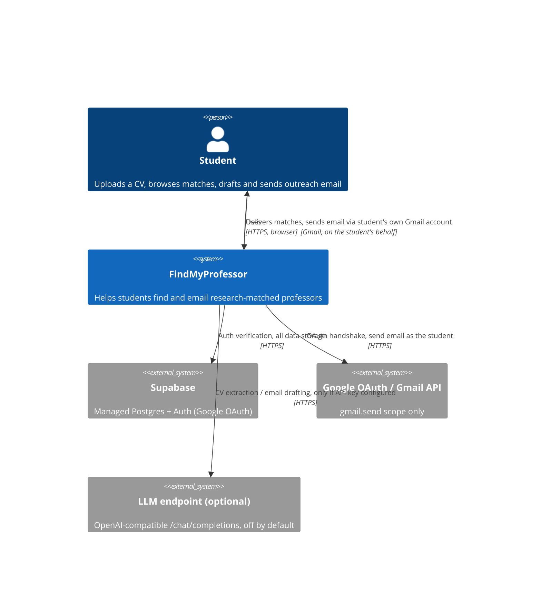
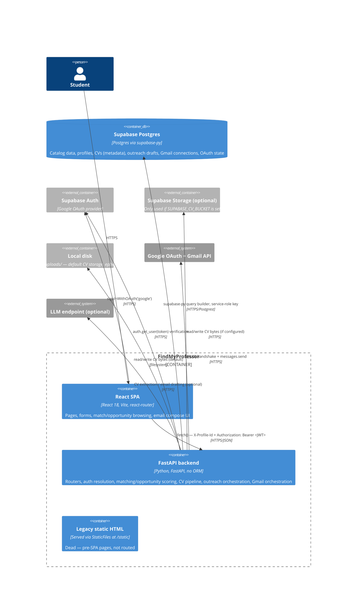
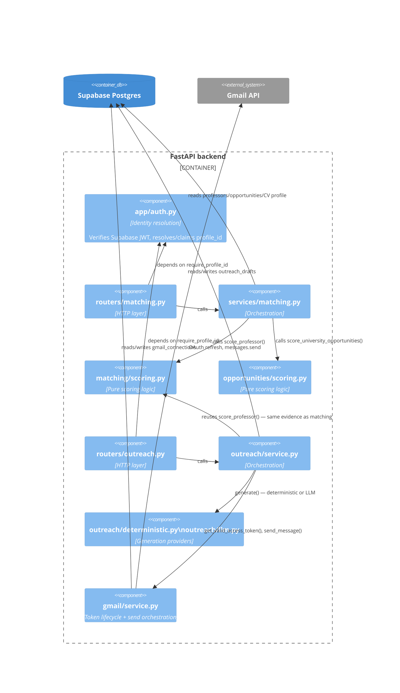
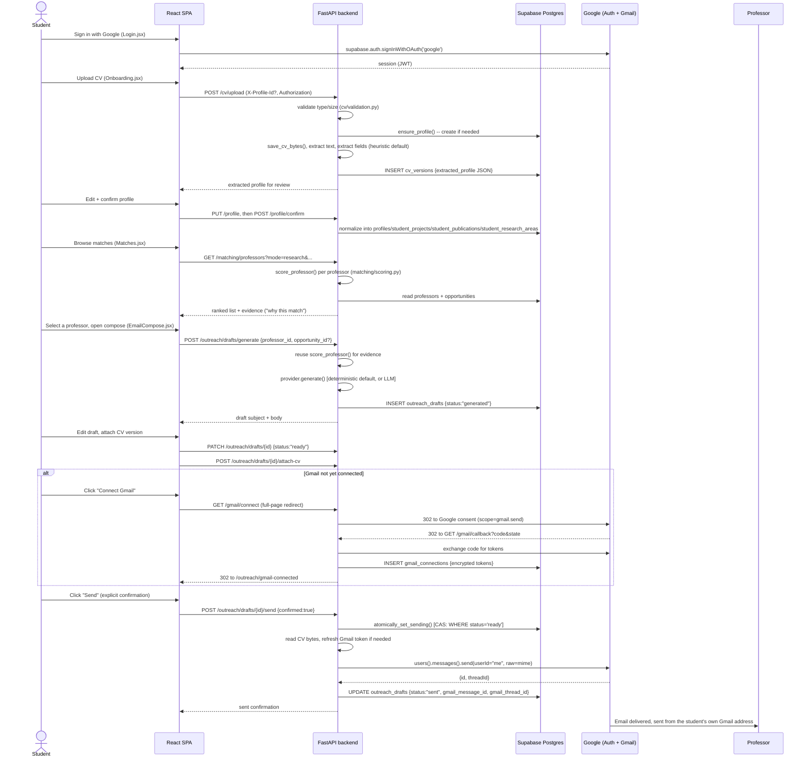

# FindMyProfessor — Architecture & Learning Manual

This is a developer learning manual for the **current** FindMyProfessor codebase, written to be traceable to actual source files, not a description of an idealized architecture. Every claim below is either backed by a `file:line` citation or explicitly marked `NOT VERIFIED FROM CURRENT CODEBASE`. Where the system is incomplete, inconsistent between dev and prod, or has a known gap, that is stated directly rather than smoothed over — the goal is for you to be able to defend every sentence here if a supervisor or interviewer pushes on it.

Detailed subsystem write-ups live in [`docs/architecture/`](architecture/); this file is the map, the causal end-to-end story, and the interview/cheat-sheet material.

**Detail documents:**
[Data Model & DB](architecture/data-model.md) ·
[Auth vs Authorization](architecture/auth-and-authorization.md) ·
[CV Pipeline](architecture/cv-pipeline.md) ·
[Matching Engine](architecture/matching-engine.md) ·
[Email Generation](architecture/email-generation.md) ·
[Gmail OAuth](architecture/gmail-oauth.md) ·
[Gmail Send](architecture/gmail-send.md) ·
[Frontend](architecture/frontend.md) ·
[Backend](architecture/backend.md) ·
[Deployment](architecture/deployment.md) ·
[Security](architecture/security.md) ·
[Failure Scenarios](architecture/failure-scenarios.md) ·
[API Map](architecture/api-map.md)

---

## Section 1 — System Overview

**Product purpose:** FindMyProfessor helps a student find professors whose research genuinely overlaps with their own background (from their CV), and then helps them write and send a credible, personalized outreach email — without fabricating claims about either the student or the professor.

**Main user journey:** sign in → upload a CV → review/confirm the extracted profile → browse ranked professor matches (and funded opportunities) → pick one → generate an email draft → edit it → connect Gmail → send, with an explicit confirmation step. Full causal trace: [Section 4](#section-4--end-to-end-user-flow).

**Major subsystems** (each with its own detail doc):
- **Frontend** — React 18 SPA, Vite build, Supabase JS client for auth
- **Backend** — FastAPI, no ORM, talks to Postgres exclusively through the Supabase query builder
- **Database** — Supabase-hosted Postgres; base catalog schema lives outside version control, four incremental migrations are tracked
- **Authentication** — Supabase Auth (Google OAuth) + a legacy client-supplied profile-id header, mid-hardening
- **CV processing** — format-specific text extraction, then heuristic (default) or optional LLM structured-field extraction
- **Matching engine** — deterministic, rule-based scoring; zero ML/embeddings
- **Outreach/email generation** — deterministic template provider (default) or optional LLM provider, both fed only verified/matched evidence
- **Gmail OAuth** — `gmail.send`-only scope, encrypted token storage
- **Gmail API** — actual send call, MIME construction, CV attachment
- **Deployment infrastructure** — inferred to be Render (backend) + a custom domain (frontend host unconfirmed); no deployment manifest is checked into this repo
- **External services** — Supabase (DB + Auth), Google OAuth/Gmail API, optionally an OpenAI-compatible LLM endpoint

### The 30-second explanation

> "FindMyProfessor is a React + FastAPI app that parses a student's CV, deterministically scores every professor in our catalog against the student's extracted research interests, and helps the student draft and send a real email through their own Gmail account — with the email generation restricted to only the facts we've actually verified, so it can't invent claims about either party. There's no ML model in the matching engine; it's rule-based and reproducible on purpose."

### The 2-minute explanation

> "The backend is a FastAPI service with no ORM — every DB call goes through Supabase's query builder directly, using a service-role key, so authorization is enforced entirely in application code by filtering on `profile_id`, not by Postgres Row-Level Security. A student's CV goes through a format-specific text extractor (pypdf/python-docx/etc.) and then a structured-field parser — by default a regex/heuristic parser, with an optional LLM path behind an environment variable that's off unless you set an API key.
>
> Once the student confirms their extracted profile, a deterministic scoring function compares their research interests, inferred signals, and project/publication evidence against every professor's tagged research areas, weighted 55/20/20/5 and renormalized across whatever signal types the student actually has — so a thin CV isn't unfairly penalized. The exact same scoring function is reused when generating an outreach email, so the email's claims about 'shared research interest' are the same claims the matching UI already showed the student, not a second, independently-generated set of claims.
>
> Email generation itself is provider-abstracted: a template-based deterministic provider by default, or an LLM provider if configured — and if the LLM call fails, it silently falls back to the deterministic provider rather than erroring. The anti-hallucination strategy is entirely about restricting what data reaches the prompt (only verified, matched fields — never the raw CV, never the professor's free-text bio) plus system-prompt instructions; there's no post-generation fact-check.
>
> Authentication is Supabase Auth via Google OAuth, but the app has an older client-supplied `X-Profile-Id` header design underneath it, and the code is mid-way through hardening that: once a real session is presented, that header can no longer reach a different account's data, but a request with no session at all still trusts the header outright — that's a documented, known gap, not a hidden one.
>
> Sending is entirely manual and single-shot: an explicit `confirmed:true` flag is required, and an atomic compare-and-swap on the draft's status prevents double-sends. There's no scheduler, no automatic follow-up, and the Gmail OAuth scope is `gmail.send` only — the app can never read the student's actual inbox."

---

## Section 2 — C4 Architecture

### System Context



**In plain English:** a student only ever talks to the FindMyProfessor system. Behind the scenes, that system depends on three external services: Supabase for identity and all persistent data, Google for both login (via Supabase's Google provider) and the actual sending of email, and — only if explicitly configured — an LLM endpoint for two optional smart features. The system never emails the professor "as itself" — it always sends through the student's own authorized Gmail account.

### Container Diagram



**In plain English:** there are really only two live containers — the React SPA and the FastAPI backend. The backend is a single process talking to five external dependencies (Supabase DB, Supabase Auth, Google, an optional LLM, and either local disk or Supabase Storage for files). The "legacy static HTML" container is included for completeness but is inert — see [Deployment §6](architecture/deployment.md#6-legacy-static-html-pages).

### Component diagram — backend, matching + outreach area



**In plain English:** the matching engine and the outreach/email system are not two independent implementations of "does this student fit this professor" — the outreach service directly reuses the matching engine's `score_professor()` function to build its evidence. This is a deliberate consistency guarantee: whatever the matching UI told the student about their overlap with a professor is exactly what the generated email is allowed to claim.

---

## Section 3 — Repository Map

```
FindMyProfessor/
├── backend/
│   ├── app/
│   │   ├── main.py              # FastAPI app, CORS, router registration — backend/backend.md
│   │   ├── auth.py               # Identity resolution — the single most important file for security
│   │   ├── supabase_client.py    # One shared Supabase client, service-role key
│   │   ├── routers/              # HTTP surface only, one file per resource
│   │   ├── schemas/               # Pydantic request/response contracts
│   │   ├── services/              # Business logic for catalog + profile domain
│   │   ├── matching/               # Pure scoring logic (no I/O) — scoring.py, normalize.py, evidence.py
│   │   ├── opportunities/          # Pure opportunity scoring logic
│   │   ├── cv/                     # parsers/ (per-format text extraction), extraction/ (heuristic|LLM), storage.py, validation.py
│   │   ├── outreach/                # service.py orchestration, deterministic.py/llm.py providers, db_store.py
│   │   ├── gmail/                    # oauth.py, client.py, crypto.py, service.py
│   │   ├── ingestion/                 # /data JSON -> Supabase, manual/one-time, not part of request handling
│   │   └── static/                    # Legacy pre-SPA HTML — dead, see deployment.md
│   ├── migrations/                # Only 4 files — incremental hardening migrations, NOT the full schema
│   ├── tests/                     # pytest — read these to see real expected behavior
│   └── scripts/seed_data.py       # Manual entrypoint for the ingestion pipeline
├── frontend/
│   └── src/
│       ├── App.jsx                # Route table
│       ├── pages/                 # One component per route
│       ├── services/               # api.js (identity headers!), gmail.js, matching.js, outreach.js, profile.js
│       ├── hooks/                  # useAuth, useGmailStatus, useProfileId
│       ├── lib/supabase.js         # Supabase client (hardcoded URL/anon key)
│       └── components/             # AppShell, GmailWidget, ProfessorCard, MatchScore, etc.
└── data/                          # Source-of-truth JSON catalog: universities/departments/labs/professors/opportunities/research_areas
```

**Where to look for what:** identity/security → `backend/app/auth.py` + [Auth vs Authorization](architecture/auth-and-authorization.md); "why did this score come out this way" → `backend/app/matching/scoring.py` + [Matching Engine](architecture/matching-engine.md); "why didn't my CV parse" → `backend/app/cv/` + [CV Pipeline](architecture/cv-pipeline.md); "why did sending fail" → `backend/app/gmail/` + `backend/app/outreach/service.py` + [Gmail Send](architecture/gmail-send.md).

---

## Section 4 — End-to-End User Flow



| Step | Frontend | Endpoint | Router | Service | DB | External API | Key object |
|---|---|---|---|---|---|---|---|
| Sign in | `Login.jsx` | — | — | — | `auth.users` (Supabase-managed) | Google via Supabase Auth | Session JWT |
| Upload CV | `Onboarding.jsx` | `POST /cv/upload` | `routers/cv.py` | `services/cv.py::upload_and_parse` | `cv_versions` insert | none (or LLM if configured) | `ExtractedStudentProfile` |
| Confirm profile | `Onboarding.jsx` | `PUT /profile`, `POST /profile/confirm` | `routers/profile.py` | `services/cv.py` | `profiles`, `student_projects`, `student_publications`, `student_research_areas` | none | `StudentProfileUpdate` |
| Browse matches | `Matches.jsx` | `GET /matching/professors` | `routers/matching.py` | `services/matching.py` | reads `professors`, `opportunities` | none | `MatchResult` |
| Generate email | `EmailCompose.jsx` | `POST /outreach/drafts/generate` | `routers/outreach.py` | `outreach/service.py` | `outreach_drafts` insert | none (or LLM) | `EmailDraft` |
| Edit / attach CV | `EmailCompose.jsx` | `PATCH .../{id}`, `POST .../{id}/attach-cv` | `routers/outreach.py` | `outreach/service.py` | `outreach_drafts` update | none | — |
| Connect Gmail | `GmailWidget.jsx` | `GET /gmail/connect`, `GET /gmail/callback` | `routers/gmail.py` | `gmail/oauth.py`, `gmail/service.py` | `gmail_oauth_states`, `gmail_connections` | Google OAuth | Encrypted token pair |
| Send | `EmailCompose.jsx` | `POST .../{id}/send` | `routers/outreach.py` | `outreach/service.py` + `gmail/service.py` | `outreach_drafts` update, `gmail_connections` read | Gmail API | `gmail_message_id` |

---

## Section 21 — "How I would explain this in an interview"

**1. Explain FindMyProfessor's architecture.**
*Short:* "React SPA talking to a FastAPI backend, which is the only thing that touches Supabase Postgres, Supabase Auth, Google's OAuth/Gmail API, and an optional LLM endpoint. No ORM — direct Supabase query builder calls. No RLS — authorization is entirely application-code enforced."
*Deeper:* see [Section 1's 2-minute explanation](#the-2-minute-explanation) and [Backend](architecture/backend.md).

**2. Why React + FastAPI?**
*Short:* "A fast-iterating SPA for a form-heavy, multi-step UI (onboarding → matches → compose), paired with a typed, async-friendly Python backend where the CV-parsing and scoring logic needed real string/regex/date processing — not something you'd want to write in a thinner backend."
*Deeper:* the CV pipeline (`backend/app/cv/`) and matching engine (`backend/app/matching/`) are pure Python with dependency-injected providers (`app/cv/extraction/factory.py`, `app/outreach/factory.py`) — a pattern that's straightforward in FastAPI and would need more scaffolding elsewhere.

**3. How does CV analysis work?**
*Short:* "Format-specific text extraction (pypdf/python-docx/olefile/odfpy/striprtf depending on file type), then a structured-field parser — regex/heuristic by default, an optional LLM behind an env var."
*Deeper:* [CV Pipeline](architecture/cv-pipeline.md), files: `backend/app/cv/parsers/registry.py`, `backend/app/cv/extraction/factory.py`, `heuristic.py`, `llm.py`.

**4. How do you match students with professors?**
*Short:* "A weighted overlap score across four signal types — explicit interests (55%), inferred signals (20%), project/publication evidence (20%), and free-text corroboration (5%) — with weights renormalized across whichever signal types the student actually has data for."
*Deeper:* [Matching Engine](architecture/matching-engine.md), file: `backend/app/matching/scoring.py`. Be ready to walk through the worked example (score = 67) by hand.

**5. Is matching AI-based?**
*Short:* "No — zero ML, zero embeddings, purely deterministic set-intersection scoring. That's a deliberate choice, not a limitation I'm apologizing for."
*Deeper:* explain *why* (see Q6).

**6. Why deterministic matching?**
*Short:* "Reproducibility and explainability — a student can see exactly which research areas overlapped and why a score is what it is, with zero API cost and zero risk of an LLM inventing a match that isn't real."
*Deeper:* the same `score_professor()` function is reused verbatim by the email generator (`outreach/service.py::_build_match_context`), so the matching UI and the generated email can never disagree about what the "real" overlap is.

**7. How is email personalization done?**
*Short:* "A generation-provider abstraction — a deterministic template provider by default, or an LLM provider if an API key is configured — both fed only pre-verified, matching-scored evidence, never the raw CV or the professor's full bio."
*Deeper:* [Email Generation](architecture/email-generation.md), file: `backend/app/outreach/llm.py:48-97` for the exact prompt-construction fields.

**8. How does Gmail OAuth work?**
*Short:* "Standard authorization-code flow, `gmail.send`-only scope, CSRF state persisted in a DB table (not memory, so it survives redeploys/multiple workers) with a 10-minute TTL and single-use enforcement via delete-on-read."
*Deeper:* [Gmail OAuth](architecture/gmail-oauth.md), file: `backend/app/gmail/oauth.py`.

**9. Authentication vs. authorization — what's the difference here?**
*Short:* "Authentication is 'who is this' — verified via a real round-trip to Supabase's Auth server when a session token is present. Authorization is 'what can they touch' — enforced entirely in application code by filtering on `profile_id`, with no database-level backstop, because the backend uses the service-role key which bypasses RLS."
*Deeper:* [Auth vs Authorization](architecture/auth-and-authorization.md) — and be ready to state the known gap directly: no `Authorization` header at all still means the legacy `X-Profile-Id`-trust path is used.

**10. Why `gmail.send` instead of full Gmail access?**
*Short:* "Least privilege — the app only ever needs to send one email on the student's behalf; it has no legitimate reason to read their inbox, so it doesn't ask to."
*Deeper:* `backend/app/gmail/oauth.py:64` — literally the only scope string in the codebase.

**11. How are Gmail tokens secured?**
*Short:* "Encrypted at rest with Fernet, keyed by an environment variable that's hard-required in a declared production environment."
*Deeper:* [Gmail OAuth §7](architecture/gmail-oauth.md#7-token-encryption) — and be ready to name the one real gap: that production check uses `ENVIRONMENT`, not the `RENDER` variable a sibling check uses, after `ENVIRONMENT` was once left unset on a real deploy.

**12. What happens when a Gmail token expires?**
*Short:* "It's refreshed lazily, right before a send, with a 60-second buffer. If Google rejects the refresh (revoked/invalid), the connection is marked revoked and the user is told to reconnect."
*Deeper:* [Gmail OAuth §9](architecture/gmail-oauth.md#9-token-refresh).

**13. How do you prevent sending without user confirmation?**
*Short:* "A required (no-default) `confirmed` boolean, checked both by schema validation and again explicitly in code, plus an atomic database compare-and-swap on the draft's status so a double-click can't send twice."
*Deeper:* [Gmail Send §2-3](architecture/gmail-send.md#2-explicit-confirmation-requirement-enforced-twice).

**14. How do you prevent fabricated professor information?**
*Short:* "By restricting what data physically reaches the generation step, not by checking the output afterward — the LLM path only ever sees pre-verified, matched fields, never the professor's raw bio or the student's full CV."
*Deeper:* [Email Generation §4-6](architecture/email-generation.md#4-what-data-enters-the-llm-prompt--and-what-deliberately-doesnt) — and be honest that there is no post-generation fact-check; that's a real, stated limitation.

**15. How is the CV attached [to a sent email]?**
*Short:* "The frontend only ever holds an opaque `cv_version_id`; the backend resolves that to an actual file path and reads the bytes server-side at send time — the storage path itself never appears in any API response."
*Deeper:* [Gmail Send §4](architecture/gmail-send.md#4-cv-attachment).

**16. How is user data isolated?**
*Short:* "Every query filters by `profile_id`, enforced in application code. There's no Row-Level Security backstop because the backend connects with the service-role key."
*Deeper:* [Data Model §5](architecture/data-model.md#5-row-level-security--explicitly-not-used).

**17. What are the current architectural limitations?**
*Short:* "No DB-level authorization backstop, local-disk-default CV storage that's unsafe on the inferred hosting platform unless a specific env var is set, no post-generation hallucination check, and a legacy unauthenticated-header path that's only partially closed."
*Deeper:* [Security §2](architecture/security.md#2-known-security-gaps--production-hardening--only-what-the-code-shows) — this is the single best section to have memorized before an interview.

**18. What would you improve next?**
*Short:* "Close the remaining `X-Profile-Id`-without-a-session gap, align the token-encryption production guard with the `RENDER`-aware guard used elsewhere, and switch default CV storage to the Supabase Storage bucket path."
*Deeper:* those are exactly the top three items in [Security §2](architecture/security.md#2-known-security-gaps--production-hardening--only-what-the-code-shows), items 1, 3, and 4.

**19. How would you scale this architecture?**
*Short:* "The stateless FastAPI process already scales horizontally as-is — OAuth state and Gmail tokens were deliberately moved out of in-memory storage into the database specifically to support multiple workers/instances. The heavier lift would be the matching engine's per-request full scan/score of the professor catalog, which would need caching or pre-computation at a larger catalog size."
*Deeper:* the `gmail_oauth_states` migration comment (`backend/migrations/20260910_gmail_oauth_states.sql:6-9`) states this exact multi-worker reasoning directly.

**20. What happens from clicking "Send" until the professor receives the email?**
*Short:* walk through the [Gmail Send sequence diagram](architecture/gmail-send.md#9-full-sequence-diagram) — validate → atomic CAS to `sending` → read CV bytes → refresh token if needed → build MIME → call `users.messages.send` → update DB to `sent`/`failed`.

---

## Section 22 — Learning Roadmap

| Level | Focus | Files to read | Concepts | Questions to answer before moving on |
|---|---|---|---|---|
| 1 | Overall architecture | `backend/app/main.py`, `frontend/src/App.jsx` | Containers, routing, CORS | What are the only two live containers? Why is CORS an explicit allow-list here specifically? |
| 2 | Frontend/backend communication | `frontend/src/services/api.js`, `backend/app/auth.py` | Header-based identity, dependency injection | What two headers does every API call carry, and what does the backend do differently depending on which are present? |
| 3 | Database/data model | [Data Model](architecture/data-model.md), `backend/migrations/*.sql` | RLS vs. app-layer authorization, upsert-based seeding | Why does `profiles.id` equal an `auth.users.id`? Why is RLS not used here? |
| 4 | CV pipeline | `backend/app/cv/validation.py`, `parsers/registry.py`, `extraction/factory.py` | Content sniffing, provider abstraction | What determines heuristic vs. LLM extraction? What happens to the *file* vs. the *DB row* when parsing fails? |
| 5 | Matching engine | `backend/app/matching/scoring.py`, `tests/test_matching_scoring.py` | Weighted renormalization, coverage scoring | Why does a student with only one signal type still get a full-scale score? What's the one hardcoded generic term? |
| 6 | Email generation | `backend/app/outreach/service.py`, `llm.py`, `deterministic.py` | Provider abstraction, evidence reuse | Which function does outreach reuse from matching, and why does that matter? What happens on LLM failure? |
| 7 | Authentication | `backend/app/auth.py` in full | JWT verification, profile claiming | What's the one remaining gap the code itself documents? |
| 8 | Gmail OAuth | `backend/app/gmail/oauth.py`, `crypto.py` | CSRF state, token encryption | Why was OAuth state moved out of memory into a table? What's the encryption-key production guard's blind spot? |
| 9 | Gmail API sending | `backend/app/gmail/client.py`, `outreach/service.py::send_draft` | MIME construction, atomic CAS | How is a double-send prevented at the database level? |
| 10 | Deployment/security | [Deployment](architecture/deployment.md), [Security](architecture/security.md) | Ephemeral disk risk, missing manifests | What hosting platform is inferred, and from what evidence specifically (not just a comment)? |

---

## Section 23 — Architecture Glossary

| Term | In FindMyProfessor's context |
|---|---|
| **Router** | A FastAPI `APIRouter` in `backend/app/routers/` — declares HTTP paths/methods, delegates to a service function immediately; contains no business logic itself |
| **Schema** | A Pydantic model in `backend/app/schemas/` — the typed contract for a request body or response shape |
| **Service** | A plain Python module in `backend/app/services/` (or `outreach/service.py`, `gmail/service.py`) doing the actual orchestration — DB reads/writes, calling into pure-logic modules like `matching/scoring.py` |
| **Provider (abstraction)** | The `EmailGenerationProvider`/CV-extraction-provider pattern: an abstract interface with two swappable implementations (deterministic and LLM), chosen at runtime by an environment variable |
| **Fallback** | Specifically: LLM generation failure silently falling back to the deterministic provider — recorded identically to "LLM never configured," which is a real observability gap here |
| **Deterministic matching** | Matching computed by a pure function of set intersections and fixed weights — same inputs always produce the same score, no randomness, no model inference |
| **Renormalization** | In `matching/scoring.py::combine_components` — redistributing a missing signal type's weight proportionally across the signal types that *do* have data, rather than treating a missing signal as a zero |
| **RLS (Row-Level Security)** | A Postgres feature this project does **not** rely on — the backend's service-role key bypasses it, so all isolation is application-code enforced |
| **JWT** | The Supabase Auth session token, verified server-side via `supabase.auth.get_user(token)` — a real check against Supabase's Auth server, not a locally-decoded/unverified token |
| **OAuth State** | A one-time, 10-minute-TTL, database-persisted CSRF token used only during the Gmail connect handshake — unrelated to the Supabase session JWT |
| **Scope (OAuth)** | The specific permission being requested from Google — here, exactly `gmail.send`, nothing broader |
| **Supabase** | The hosted Postgres + Auth + Storage platform this project uses for its database, login provider, and (optionally) CV file storage |
| **MIME** | The email message format — built here with Python's stdlib `email.mime`, then base64url-encoded for the Gmail API's `messages.send` |
| **CV parsing** | Two distinct steps conflated in casual speech: (1) text extraction (format → plain text) and (2) structured-field extraction (plain text → named fields) — see [CV Pipeline](architecture/cv-pipeline.md) |
| **CORS** | Configured here as an explicit origin allow-list, never a wildcard, specifically because this app's identity model is header-based rather than cookie-based |
| **SPA** | The React frontend — a single HTML shell where `react-router-dom` handles all navigation client-side |
| **Idempotent (ingestion)** | The `/data` → database seeder can be re-run safely — it diffs against existing rows and only writes what actually changed |
| **Atomic CAS (compare-and-swap)** | The `UPDATE outreach_drafts SET status='sending' WHERE status='ready'` pattern that prevents a draft from being sent twice |

---

## Final Cheat Sheets

### A. One-page architecture cheat sheet
- Two live containers: React SPA + FastAPI backend. No ORM. No server-side sessions/cookies — identity travels in headers.
- Five external dependencies: Supabase Postgres, Supabase Auth, Google OAuth/Gmail, optional LLM endpoint, and either local disk or Supabase Storage for CV files.
- No deployment manifest in-repo; backend hosting on Render is strongly inferred (a functional `RENDER` env-var check exists), frontend host unconfirmed.
- Authorization = application code filtering by `profile_id`; there is no database RLS backstop.

### B. One-page request/data-flow cheat sheet
`HTTP request → CORSMiddleware (main.py) → Router → auth dependency (require_profile_id/resolve_identity) → Pydantic schema validation → Service function → services/query.py::execute() → Supabase (service-role key) → Postgres → Pydantic response schema → JSON.` Every response error is generic/safe; real Postgrest errors are logged server-side only.

### C. One-page auth + Gmail OAuth cheat sheet
Two headers on every request: `X-Profile-Id` + `Authorization: Bearer <JWT>`. No session → trust the header (legacy path, documented gap). Valid session → header can never reach another account; unlinked legacy profiles get auto-claimed once. Gmail is a *separate* grant: `gmail.send`-only scope, encrypted token pair in `gmail_connections`, CSRF state in `gmail_oauth_states` (10-min TTL, single-use via delete).

### D. One-page matching-engine cheat sheet
`score = combine_components({interests: 0.55, signals: 0.20, artifacts: 0.20, corroboration: 0.05})`, each component = `100 * |student ∩ professor| / |student|`, weights **renormalized** across whichever components have data. One hardcoded generic term stripped: `"computer science"`. Priority: `>=80 high`, `>=50 normal`, else `low`. Opportunity scoring is separate: `open=100/upcoming=80/unknown=50` base, `+5` international, `+10` undergrad-detected, capped at 100, best-single-opportunity only (no stacking). Zero ML anywhere.

### E. One-page CV pipeline cheat sheet
Upload → 3-layer validation (extension + magic-byte sniff + cross-check) → store (local disk by default, unsafe per the code's own comment unless `SUPABASE_CV_BUCKET` is set) → format-specific text extraction (pypdf/python-docx/olefile/odfpy/striprtf) → structured extraction (**heuristic by default**; LLM only if `LLM_API_KEY` set, no fallback between the two) → full JSON blob stored on every upload → normalized tables written only on explicit `/profile/confirm`. Matching only ever consumes `research_interests`/`research_signals`/`projects`/`publications` — never `skills`, `education`, or `identity`.

### F. One-page email-generation cheat sheet
Lifecycle: `generated → edited/ready → sending (atomic CAS) → sent | failed`. Evidence reuses matching's exact `score_professor()`. Prompt gets only verified fields (never raw CV, never professor's free-text bio). Deterministic provider is pure template substitution — fabrication-proof by construction. LLM provider falls back silently to deterministic on any failure, and that fallback is **indistinguishable** in stored data from "LLM never configured." No post-generation fact-check exists. Send requires a required `confirmed:true` flag, checked twice, plus the atomic CAS.

### G. Interview questions and answers
See [Section 21](#section-21--how-i-would-explain-this-in-an-interview) above — 20 pre-written short + deep answers with file citations.

### H. Things I should inspect in the code myself
1. Whether `backend/migrations/20260910_profiles_linked_user_id.sql` has actually been applied to the *current* live Supabase project (a past test comment found it hadn't been, at least once) — this directly determines whether the auth-hardening in `auth.py` is fully active in production right now.
2. Whether `SUPABASE_CV_BUCKET` is set in the actual production environment (not just absent from the `.env` files present in this repo) — this determines whether CV files actually survive redeploys today.
3. Whether `GOOGLE_TOKEN_ENCRYPTION_KEY` and `ENVIRONMENT` are both correctly set in the live Render service — the flagged gap in `crypto.py` only manifests if both happen to be unset simultaneously.
4. Whether `outreach_drafts.selected_opportunity_id` is genuinely never populated by `generate_draft()`, and if so, whether that's a real bug worth fixing.
5. Whether `student_projects`/`student_publications`/`student_research_areas` are read anywhere this pass didn't find — if truly unread, that's persisted-but-dead data worth either wiring up or removing.
6. Whether any rate limiting exists at the hosting-platform level (outside this repo) even though none exists in application code.
