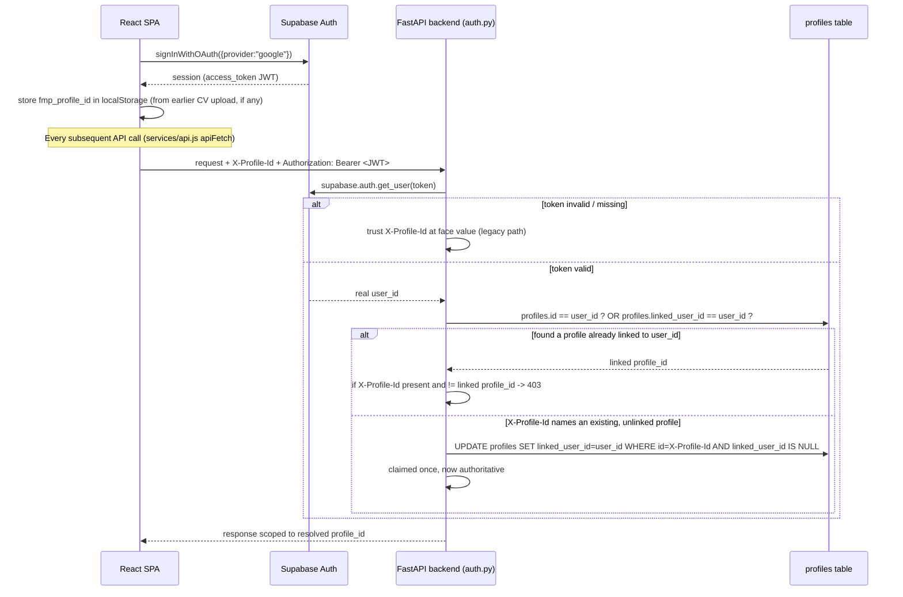

# Authentication vs. Authorization

> Part of the [FindMyProfessor Architecture Documentation](../ARCHITECTURE.md).

This is the single most important section to understand correctly, both for the current security posture and for explaining the system honestly in an interview. FindMyProfessor has **three distinct identity/permission systems** that are easy to conflate:

1. **Application authentication** — "who is making this HTTP request to our backend?"
2. **Profile/data isolation (authorization)** — "which student's data is this request allowed to touch?"
3. **Gmail OAuth authorization** — "has this student granted us permission to send email as them, via Google?"

They are independent. A user can be authenticated (signed in with Google via Supabase) and still have no Gmail connection; a user can have a Gmail connection tied to a profile they no longer control the session for (in theory); and — critically — **for most of this app's history, "authentication" meant nothing more than a client-supplied header**, which is the gap the current code is in the middle of closing.

## 1. Application authentication

### What identifies "the user" today

Two signals travel on every API request, both attached by `frontend/src/services/api.js:23-51` (`apiFetch`):

- **`X-Profile-Id` header** — the application's own profile UUID, read from `localStorage.getItem('fmp_profile_id')` on the frontend.
- **`Authorization: Bearer <token>` header** — a live Supabase session access token, fetched fresh from `supabase.auth.getSession()` on every single API call.

The backend resolves these in `backend/app/auth.py`. Read the module docstring (`auth.py:3-33`) — it is unusually candid about its own history:

> "Every endpoint previously trusted a client-supplied `X-Profile-Id` header at face value, with no verification that the caller was actually the owner of that profile. Any client could set `X-Profile-Id` to any UUID and read/modify that profile's CVs, drafts, and Gmail connection." (`auth.py:6-10`)

That is the **original** authentication model, and it is still partially in effect today (see below).

### The current (partially hardened) model

`resolve_identity()` (`auth.py:156-196`) is the core dependency:

```python
def resolve_identity(authorization, x_profile_id) -> Identity:
    user_id = get_authenticated_user_id(authorization)   # verifies the Supabase JWT
    if not user_id:
        # No verifiable session at all — legacy path, unchanged behavior
        return Identity(profile_id=x_profile_id, user_id=None, authenticated=False)

    linked_id = _find_linked_profile_id(user_id)
    if linked_id:
        if x_profile_id and x_profile_id != linked_id:
            raise HTTPException(403, "X-Profile-Id does not match the authenticated account.")
        return Identity(profile_id=linked_id, user_id=user_id, authenticated=True)
    ...
```

`get_authenticated_user_id()` (`auth.py:53-73`) is real verification: it calls `supabase.auth.get_user(token)`, which round-trips to Supabase's own Auth server and validates the JWT signature/expiry there. This is **not** a locally-decoded, unverified JWT — it is actually checked against Supabase.

**The rule in plain terms:**
- If the request carries **no** `Authorization` header at all → the backend falls all the way back to trusting `X-Profile-Id` verbatim, exactly as the original (unsafe) design did. This is explicitly called out as intentional transitional behavior (`auth.py:22-26`): "this keeps any caller that has not yet been updated to send a Supabase session working exactly as it did."
- If the request **does** carry a valid Supabase session → `X-Profile-Id` can no longer be used to reach a different account's profile. A mismatch is a hard `403`. An `X-Profile-Id` for a profile that predates the user's first login gets auto-claimed once (`_claim_profile`, `auth.py:141-153`) via the `linked_user_id` column.

### Why `profiles.id` equals `auth.users.id`

`profiles.id` is engineered to literally be a Supabase Auth user id, not an app-generated UUID. Two creation paths exist (`backend/app/services/cv.py`):

- **User signs in with Google first, then uploads a CV** (the intended path going forward): `ensure_profile(profile_id=None, user_id=<real supabase user id>)` (`cv.py:71-110`) creates `profiles` with `id = user_id` directly — no separate linking step needed at all, because the profile's primary key *is* the authenticated user's id.
- **User uploads a CV before ever signing in** (the original "no login required" design, still reachable): `_provision_auth_user()` (`cv.py:134-162`) calls `supabase.auth.admin.create_user(...)` to fabricate a **synthetic** `auth.users` row — a fake email like `student-<uuid>@local.findmyprofessor.invalid` with a random password the student never sees — purely so `profiles.id` (which has a foreign-key-like dependency on `auth.users.id`) has something valid to point at. The code comment is explicit: *"No login UI is added"* (`cv.py:135`) at this call site. When that same person later actually signs in with Google, `linked_user_id` (added by `backend/migrations/20260910_profiles_linked_user_id.sql`) is what connects their *real* Google identity to their *pre-existing, synthetic-identity* profile, without having to migrate the profile's primary key (which would cascade through `cv_versions`, `outreach_drafts`, `gmail_connections`).

**"Who is this user?" — honest answer:** it depends which path they came through. If they signed in with Google first, `profiles.id` is a real, Google-verified identity. If they uploaded a CV first (still possible today — CV upload does not require a session), `profiles.id` initially points at a synthetic, no-one-ever-authenticates-as-this-directly `auth.users` row, and only becomes tied to a real person once/if they sign in with Google and the app auto-claims it.

### What is NOT verified / the remaining gap

The module docstring states this outright (`auth.py:29-32`): "a caller presenting no Authorization header at all is still trusted on `X-Profile-Id` alone." Any client that simply omits the `Authorization` header can still access any profile by guessing/copying its UUID — the hardening only closes the gap for callers who *do* present a Supabase session. Whether the frontend today always sends a session (once one exists) is one thing; whether some *other* client (a direct API caller, a script, curl) sends one is entirely out of the app's control. **This is the headline security caveat for this whole project — say it plainly in an interview rather than hiding it.**

## 2. Authorization (profile/data isolation)

There is no role system, no admin/student distinction, and no per-endpoint permission table. Authorization in this app means exactly one thing: **every query is filtered to `profile_id = <the profile resolved by auth.py>`.** This is enforced in application code, function by function — e.g. `backend/app/outreach/service.py` checks `draft.profile_id == profile_id` before returning or mutating any draft; `backend/app/services/cv.py` filters every `cv_versions` query by `profile_id`.

As covered in [Data Model — Row-Level Security](data-model.md#5-row-level-security--explicitly-not-used), this is **not** backstopped by Postgres RLS, because the backend connects with the Supabase service-role key, which bypasses RLS entirely. Authorization is therefore a property of the backend's code being correct everywhere, not a property the database itself guarantees.

**"What is this user allowed to access?" — precise answer:** whatever rows have `profile_id` equal to the profile id that `auth.py` resolved for this request — and only because every service function remembers to filter on it.

## 3. Gmail OAuth authorization — a third, separate thing

Being authenticated to the app (having a valid Supabase session / resolved profile) is completely independent of having authorized Gmail. A user can use every feature of the app — CV upload, matching, drafting emails — without ever connecting Gmail. Connecting Gmail is a distinct, explicit, per-profile grant, described fully in [Gmail OAuth](gmail-oauth.md). In short:

- **What external permission has the user granted?** Exactly one Google OAuth scope: `https://www.googleapis.com/auth/gmail.send` — send-only, confirmed as the literal scope string in `backend/app/gmail/oauth.py:64`. The app cannot read the user's inbox, list their contacts, or do anything with Gmail except send a message via `users.messages.send` on their behalf.
- This grant is stored as an encrypted access/refresh token pair in `gmail_connections`, one row per `profile_id` (`UNIQUE(profile_id, provider)`), not tied to the Supabase session at all — it persists independently of whether the user is currently "logged in."

## 4. Diagram — application authentication



## 5. Diagram — Gmail authorization (separate from the above)

See [Gmail OAuth](gmail-oauth.md) for the full sequence. The key point to internalize visually: this flow starts from an *already-resolved* `profile_id` (the connect endpoint requires one) and produces a completely separate artifact — an encrypted Google token pair in `gmail_connections` — that has nothing to do with the Supabase session token above.

## 6. Summary table

| Question | Application auth | Gmail OAuth |
|---|---|---|
| Who is this user? | A Supabase `auth.users.id`, verified via `supabase.auth.get_user()` — **if** a session token is presented at all | The same `profile_id`, already resolved before the Gmail flow starts |
| What proves it? | A Supabase JWT, checked against Supabase's own Auth server (`auth.py:67`) | An encrypted OAuth token pair, checked against Google |
| What can they access? | Only rows with matching `profile_id`, enforced in app code, not DB RLS | Only `gmail.send` — no read access to the user's real inbox |
| What's the known gap? | No `Authorization` header at all → falls back to trusting `X-Profile-Id` unverified (`auth.py:29-32`) | Token encryption key is required in production only via an `ENVIRONMENT` check, not the `RENDER` check used elsewhere (see [Gmail OAuth §6](gmail-oauth.md)) |
