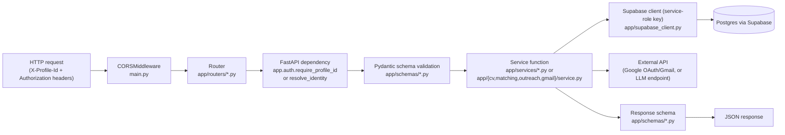

# Backend Architecture (FastAPI)

> Part of the [FindMyProfessor Architecture Documentation](../ARCHITECTURE.md).

## 1. App wiring

`backend/app/main.py` is the entire application entrypoint (100 lines). It:

- Builds an explicit CORS origin allow-list (`_cors_allowed_origins()`, `main.py:22-42`) — never a wildcard. The default set is `{"https://findmyprofessor.online", "http://localhost:5173", "http://127.0.0.1:5173"}`, extendable via the `FRONTEND_URL` and `CORS_EXTRA_ORIGINS` env vars. The code comment explains why this matters more than usual here: because identity is header-based (`X-Profile-Id`/`Authorization`), not cookie-based, a wildcard origin combined with `allow_credentials=True` would let *any* website's JavaScript make authenticated-looking cross-origin calls against this API (`main.py:24-31`).
- Registers 9 routers (`main.py:59-67`): `universities`, `departments`, `labs`, `professors`, `cv`, `profile`, `matching`, `outreach`, `gmail`.
- Mounts `/static` for the legacy static HTML directory (`main.py:69-70`) — see [Deployment — Legacy static pages](deployment.md#legacy-static-html-pages).
- Exposes `GET /` (API identity/links) and `GET /health` (pings `universities` table via Supabase, returns 503 if unreachable).
- A comment block (`main.py:73-77`) states outright that legacy server-rendered HTML pages have been removed from FastAPI's routing and the React SPA now owns all product pages.

## 2. Request lifecycle

Concretely, for a typical endpoint (e.g. `GET /matching/professors`):
1. **Router** (`backend/app/routers/matching.py`) declares the path, query params, and a `response_model`.
2. **Dependency injection** resolves `profile_id` via `app.auth.require_profile_id` — this is where identity/authorization happens, before any business logic runs (see [Auth vs Authorization](auth-and-authorization.md)).
3. **Service function** (`backend/app/services/matching.py`) does the actual work — loading data, calling into `app/matching/scoring.py` and `app/opportunities/scoring.py`, filtering, sorting.
4. **Database access** goes through `app.services.query.execute()` (`backend/app/services/query.py`) — a thin wrapper around every Supabase call that maps Postgrest errors to safe, generic HTTP errors and logs the real error server-side (see below).
5. **Response** is validated against a Pydantic model in `app/schemas/matching.py` before being returned.

## 3. Directory responsibilities

| Directory | Responsibility |
|---|---|
| `app/routers/` | HTTP surface only — path/method/param declarations, delegates immediately to a service |
| `app/schemas/` | Pydantic request/response models — the API's public contract |
| `app/services/` | Business logic for the "catalog" domain (universities/departments/labs/professors/cv/matching) — thin orchestration over Supabase queries |
| `app/matching/` | Pure scoring logic for professor research-fit (`scoring.py`, `evidence.py`, `normalize.py`, `models.py`) — no I/O |
| `app/opportunities/` | Pure scoring logic for opportunity fit (`scoring.py`, `evidence.py`, `models.py`) — no I/O |
| `app/cv/` | CV subsystem: `parsers/` (per-format text extraction), `extraction/` (structured field parsing, heuristic or LLM), `storage.py` (file I/O), `validation.py` (type/size checks) |
| `app/outreach/` | Email draft lifecycle: `service.py` (orchestration), `deterministic.py`/`llm.py` (generation providers), `db_store.py`/`store.py` (persistence), `models.py` |
| `app/gmail/` | Gmail integration: `oauth.py` (OAuth handshake), `client.py` (MIME + API calls), `crypto.py` (token encryption), `service.py` (orchestration + token refresh) |
| `app/ingestion/` | One-time/manual data-loading pipeline from `/data/*.json` into Supabase — not part of request handling; see [Data Model §4](data-model.md#4-ingestion-pipeline-how-datajson-becomes-database-rows) |
| `app/auth.py` | The one shared identity-resolution module every router depends on |
| `app/supabase_client.py` | Single shared Supabase client instance, constructed with the service-role key |
| `app/static/` | Legacy, no-longer-routed HTML pages — see [Deployment](deployment.md) |

## 4. A cross-cutting pattern: `services/query.py`

Every Supabase call in the codebase is expected to pass through `execute()` (`backend/app/services/query.py:9-30`), which:
- Catches `postgrest.exceptions.APIError` and maps it to a **generic, safe** client-facing message (`"Database query failed."`, 503; or `"Invalid ID format."`, 400 for a malformed UUID) — the real Postgrest error code/message/hint is logged server-side only, never leaked to the client.
- Provides `is_missing_column_error()` (`query.py:51-68`) — a small but important utility that lets a caller detect "this specific optional column doesn't exist yet" (e.g. `linked_user_id` before its migration is applied) and degrade gracefully instead of failing the whole request. This is actively used in `app/auth.py` (see [Auth vs Authorization](auth-and-authorization.md)) and `app/services/cv.py`.

## 5. Dependencies (from `backend/requirements.txt`)

| Category | Packages |
|---|---|
| Web/ASGI | `fastapi 0.141.1`, `starlette 1.6.0`, `uvicorn 0.52.4`, `python-multipart` |
| Validation | `pydantic 2.13.5` |
| HTTP client | `httpx` (also used for hand-rolled LLM calls) |
| Supabase | `supabase 2.31.0`, `supabase-auth`, `supabase-functions`, `postgrest`, `storage3`, `realtime` |
| Crypto/auth | `cryptography 50.0.1` (Fernet token encryption), `PyJWT` |
| Google/Gmail | `google-auth`, `google-auth-oauthlib`, `google-api-python-client` |
| CV parsing | `pypdf`, `python-docx` (+`lxml`), `striprtf`, `odfpy`, `defusedxml`, `olefile` |
| LLM | **No SDK** — both the CV extractor and the email generator make raw `httpx` calls to an OpenAI-compatible endpoint |
| Testing | `pytest 9.1.1` |

There is no ORM — every database interaction goes through the `supabase-py` query builder directly (`.table(...).select(...).eq(...).execute()`), not SQLAlchemy or similar.
