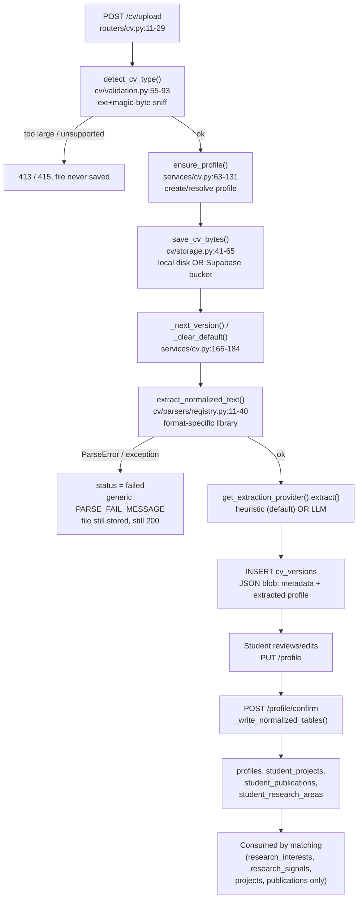

# CV Pipeline

> Part of the [FindMyProfessor Architecture Documentation](../ARCHITECTURE.md).

## 1. Flow overview

## 2. Upload endpoint

`POST /cv/upload` — `backend/app/routers/cv.py:11-29`, function `upload_cv()`. Uses `auth.resolve_identity` (not `require_profile_id`) specifically because this endpoint is allowed to *create* a brand-new profile if none exists yet. Reads the full file into memory (`file.file.read()`) and calls `cv_service.upload_and_parse()`. Two related endpoints: `GET /cv/{cv_id}` (fetch one CV version) and `POST /cv/{cv_id}/parse` (re-run extraction on an already-stored file without re-uploading).

## 3. Accepted file types

Extensions: `.pdf .docx .doc .txt .rtf .odt` (`backend/app/cv/validation.py`, `SUPPORTED_EXTENSIONS`, lines 9-16). Enforcement is **three layers deep**, not just an extension check:

1. Extension must be in the whitelist.
2. `_sniff_format()` (`validation.py:96-107`) reads the actual file bytes: `%PDF` magic header for PDF, `{\rtf` for RTF, an OLE2 header for legacy `.doc`, ZIP-internal inspection for `.docx`/`.odt` (`_sniff_zip_document`, `validation.py:110-126`), else falls back to a plain-text heuristic.
3. The sniffed format must match the claimed extension (`validation.py:78-82`) — a `.pdf` file that is secretly a text file is rejected.

The browser-declared `Content-Type` is only a soft secondary signal and is ignored outright when it's the generic `application/octet-stream` (`validation.py:83-91`). **Content sniffing is authoritative, not the declared MIME type** — this is a meaningfully more robust validation approach than trusting the `Content-Type` header alone.

## 4. Size/content validation

`MAX_CV_BYTES = 10 MB` (`validation.py:7`). `validate_size()` (`validation.py:46-52`) rejects empty files (`<= 0` bytes) and anything over 10 MB, mapped to HTTP `413`/`415` respectively. **No virus/malware scanning exists anywhere in the codebase** (confirmed by search — zero hits for any scanning library or pattern).

## 5. Storage location — local disk by default, and the code says so is risky

`backend/app/cv/storage.py`. Two backends, selected by the `SUPABASE_CV_BUCKET` environment variable (`storage.py:23`):

- **Default (variable unset): local disk**, root `backend/var/cv_uploads/` (`storage.py:9`), path pattern `{profile_id}/{cv_id}/{safe_filename}`. Path traversal is guarded via `resolve_storage_path()` (`storage.py:68-77`).
- **If `SUPABASE_CV_BUCKET` is set:** uploads to a private Supabase Storage bucket instead.

The code's own comment is explicit about the risk of the default: *"Render's local disk does NOT persist across redeploys/restarts, so local disk alone is unsafe for production CV storage."* (`storage.py:11-22`). Cross-referenced against every `.env` file present in this repo (root `.env.example`, `backend/.env`), **`SUPABASE_CV_BUCKET` is not documented and not set anywhere found** — meaning, as currently configured, CV *files* (not their metadata — the `cv_versions` DB row survives fine) are at risk of being lost on every backend redeploy if the hosting platform is Render with an ephemeral filesystem. See [Deployment](deployment.md) for the platform evidence. There is also **no file-deletion function anywhere** — uploaded CVs accumulate with no retention policy.

## 6. Text extraction per format

Dispatch: `backend/app/cv/parsers/registry.py:11-40`. Library per format (cross-referenced against `backend/requirements.txt`):

| Format | Library | Notes |
|---|---|---|
| PDF | `pypdf==6.18.0` | Handles empty-password-encrypted PDFs; raises `ParseError` on read/decrypt failure. **No OCR** — a scanned/image-only PDF with no text layer yields empty text and fails. |
| DOCX | `python-docx==1.2.0` (+`lxml`) | Standard OOXML parsing |
| DOC (legacy binary) | `olefile==0.47` + hand-rolled scraping | Not a real `.doc` parser — best-effort extraction of printable UTF-16LE/ASCII runs from the OLE2 container (`cv/parsers/doc.py`). Quality is noticeably lower than the other formats. |
| ODT | `odfpy==1.4.1` | Standard OpenDocument parsing |
| RTF | `striprtf==0.0.33` | Strips RTF control codes to plain text |
| TXT | stdlib | UTF-8 → UTF-8-sig → Latin-1 fallback chain |

## 7. Structured field extraction — heuristic vs. LLM

`get_extraction_provider()` — `backend/app/cv/extraction/factory.py:10-18` — returns `HeuristicExtractionProvider` **unless the `LLM_API_KEY` environment variable is set**, in which case it returns `LlmExtractionProvider`. **This is an important, easy-to-miss fact: LLM-based CV extraction is off by default.** The out-of-the-box behavior for every fresh deployment (including local dev with a blank `.env.example`) is the deterministic heuristic parser — zero cost, zero external API calls.

**Heuristic path** (`backend/app/cv/extraction/heuristic.py`): splits the extracted text into sections using a fixed set of heading regexes (lines 23-29 — things like "Education", "Experience", "Skills", "Publications"), then applies per-section regexes:
- Identity: email regex, phone regex, a name heuristic (first non-empty line before any section heading).
- Education: degree/field/year/institution regexes — **only ever populates a single education record**, even if the CV lists multiple degrees.
- Skills: matched against a **hardcoded, closed catalog of ~31 skill names** (`SKILL_CATALOG`, `heuristic.py:38-72`) — a skill not on this list is never extracted, no matter how it's phrased in the CV.
- Experience/projects/publications/certifications: line-based extraction, capped at 8 entries each.
- `research_interests` / `research_signals`: matched against the live `research_areas` DB catalog (fetched via `_catalog_labels()`, `services/cv.py:454-456`) — this is why extraction quality for this specific field improves as more research-area labels get seeded into the database, independent of code changes.

**LLM path** (`backend/app/cv/extraction/llm.py`): there is **no LLM SDK dependency** in `requirements.txt` — the LLM call is a hand-rolled `httpx` POST to an OpenAI-compatible `/chat/completions` endpoint. Default `LLM_BASE_URL=https://api.openai.com/v1`, default `LLM_MODEL=gpt-4o-mini` (from `.env.example`). **There is no fallback from LLM to heuristic if the LLM call fails** — a failed LLM extraction fails the whole upload's parsing step (see §8), it does not silently degrade to the heuristic parser.

## 8. Extracted schema fields

`ExtractedStudentProfile` — `backend/app/cv/extraction/schema.py:65-74`:

- `identity` — name, email, phone
- `education[]` — degree, field_of_study, institution, country, graduation_year, current_semester
- `research_interests[]` — explicit statements of interest
- `research_signals[]` — inferred-but-not-explicit research signal
- `skills[]` — name + category
- `experience[]` — role, organization, kind, description, start_year, end_year
- `projects[]` — title, description, technologies, research_relevance
- `publications[]` — title, venue, year, authors, publication_type
- `certifications[]` — name, issuer, year

The **heuristic** provider never populates `education.country`, `education.current_semester`, or `experience.organization` — those fields exist in the schema but are LLM-only in practice under the default configuration.

## 9. Failure handling

`upload_and_parse()` — `backend/app/services/cv.py:187-243` — wraps the whole extract+parse step in a broad `try/except`:

- Unsupported format or oversized file → rejected **before** storage, HTTP `413`/`415`, file never touches disk.
- File is a valid format but corrupt content (malformed PDF body, an encrypted PDF, empty extracted text) → the file **is still saved** to storage, but `cv_versions.description.parsing_status` is set to `"failed"` with an error message; the HTTP response is still `200 OK` (upload succeeded; parsing did not).
- Any other exception (including LLM HTTP/JSON/validation errors) is caught broadly and mapped to a single generic `PARSE_FAIL_MESSAGE` string — the real underlying error is logged server-side only, never returned to the client.
- **There is no partial-success mode.** Extraction either fully succeeds or the entire CV is marked failed — there's no "we got your education but not your skills" intermediate state.
- `confirm_profile()` (`services/cv.py:348-369`) explicitly refuses to let a student confirm a profile whose active CV has `parsing_status == "failed"` (`services/cv.py:353-354`).

## 10. What gets persisted, and when

Every upload/reparse writes one `cv_versions` row containing the **entire** `ExtractedStudentProfile` as a JSON blob inside the `description` column, alongside file metadata and parsing status (`services/cv.py:224-243`). This happens automatically on upload — no confirmation needed yet.

Only on **explicit `POST /profile/confirm`** does data get normalized into first-class columns/tables: `profiles` (name/email/university/degree/field/country/semester/graduation_year, plus synthesized `research_summary` and `bio` strings), `student_projects`, `student_publications`, and `student_research_areas` (`_write_normalized_tables`, `services/cv.py:372-433`). Confirming **deletes and re-inserts** all three of those child tables in full each time (`services/cv.py:388-390`) — there's no incremental diffing.

## 11. What matching actually consumes vs. what's extracted but unused

Cross-referencing `backend/app/matching/scoring.py` against the full `ExtractedStudentProfile` schema:

| Extracted field | Consumed by matching? |
|---|---|
| `research_interests` | **Yes** — weight 0.55, the dominant scoring component |
| `research_signals` | **Yes** — weight 0.20 |
| `projects`, `publications` (as evidence text) | **Yes** — weight 0.20 combined, via keyword-hit detection against matched areas |
| `identity` (name, email, phone) | No — used only for display/outreach personalization, not scoring |
| `education` | No |
| `skills` | **No — explicitly excluded.** A student's listed skills never contribute to a research-match score, confirmed by a dedicated test (`tests/test_matching_scoring.py:205-212`, `test_skills_do_not_become_research_interests`) |
| `experience`, `certifications` | No |

Interestingly, `student_research_areas` (the normalized DB table written on profile confirm) also appears **not** to be read by the matching engine — scoring reads `research_interests`/`research_signals` directly from the CV's JSON blob (`ExtractedStudentProfile`), not from this normalized table. This looks like persisted-but-unused data; **NOT VERIFIED FROM CURRENT CODEBASE** whether some other code path reads it.

## 12. CV versioning and its link to outreach

`cv_versions.version_number` / `is_default` give a full, ordered history of every CV a student has uploaded (`services/cv.py:165-184`). This matters for outreach: `outreach_drafts.cv_version_id` (`backend/app/outreach/models.py:44`) lets a student pin a **specific historical version** of their CV to a particular outreach draft — independent of whichever version is currently marked "default" — via `POST /outreach/drafts/{id}/attach-cv` (`backend/app/outreach/service.py:193-216`). This is validated for existence again at send time.

## 13. Known limitations (evidenced by the code, not speculation)

- No virus/malware scanning of uploaded files.
- No OCR — a scanned/image-only PDF produces an empty-text `ParseError` and a failed CV.
- Legacy `.doc` parsing is best-effort byte-scraping, not a real document parser.
- No fallback from LLM extraction failure to the heuristic parser — they are mutually exclusive per-request, selected once at the environment level.
- No file retention/deletion policy — uploads accumulate indefinitely.
- Default storage backend is local disk, which the code's own comments flag as unsafe on the inferred hosting platform (Render) unless `SUPABASE_CV_BUCKET` is explicitly configured — and it isn't, in any `.env` file present in this repo.
- Heuristic skill extraction is limited to a fixed ~31-item catalog; anything phrased differently is missed.
- Heuristic education extraction only ever captures one degree, even for CVs listing several.
- `student_projects`/`student_publications`/`student_research_areas` are written on confirm but appear unread elsewhere in the backend — likely dead data from the scoring engine's perspective (NOT VERIFIED as intentional).
