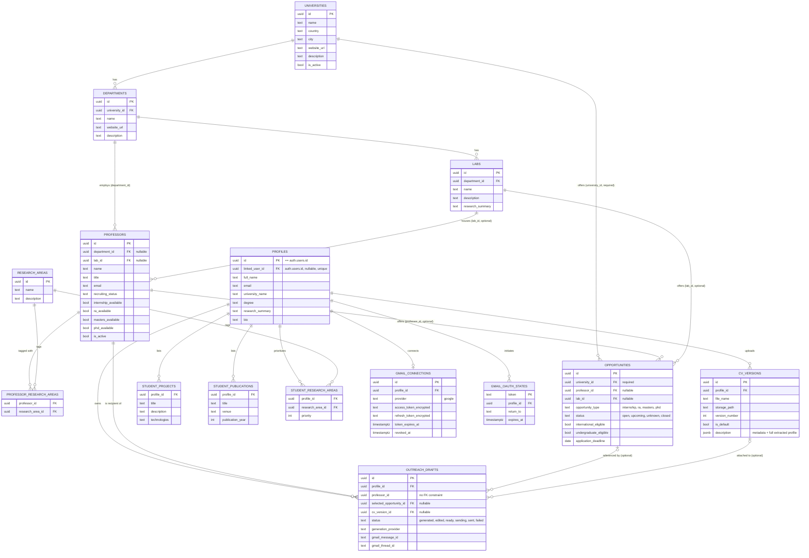

# Data Model & Database Architecture

> Part of the [FindMyProfessor Architecture Documentation](../ARCHITECTURE.md).

## 1. Where the schema actually lives

**Important limitation, stated up front:** this repository does not contain a full `CREATE TABLE` history for the "core" tables (`universities`, `departments`, `labs`, `professors`, `research_areas`, `professor_research_areas`, `opportunities`, `profiles`, `cv_versions`, `student_projects`, `student_publications`, `student_research_areas`). `backend/migrations/` contains only **four** incremental migration files, all dated 2026-09:

| File | What it does |
|---|---|
| `20260908_opportunities_nullable_professor_lab.sql` | Drops `NOT NULL` on `opportunities.professor_id` and `opportunities.lab_id` so a university-wide or lab-only opportunity can exist without a fabricated professor. |
| `20260909_outreach_drafts_gmail.sql` | Creates `outreach_drafts` and `gmail_connections` (full DDL below). |
| `20260910_gmail_oauth_states.sql` | Creates `gmail_oauth_states` (replaces an in-memory dict — see [Gmail OAuth](gmail-oauth.md)). |
| `20260910_profiles_linked_user_id.sql` | Adds `profiles.linked_user_id` + a unique partial index, to support real authentication (see [Auth vs Authorization](auth-and-authorization.md)). |

The base schema was created directly against the Supabase project (dashboard/SQL editor) outside of version control. Everything below about the core tables' **columns** is reconstructed by reading every `supabase.table(...)` call in the backend (`.select()`, `.insert()`, `.update()`, `.eq()`) plus the ingestion models in `backend/app/ingestion/models.py` and `backend/app/ingestion/seeder.py` — it is accurate to what the *application code* reads and writes, but exact column types, defaults, and constraints on these specific tables are **NOT VERIFIED FROM CURRENT CODEBASE** beyond what's inferable from usage.

## 2. Entity-relationship diagram

**Plain-English reading of the diagram:**
- The **catalog side** (universities → departments → labs → professors) is a strict tree: a professor optionally belongs to a lab, and separately to a department (both nullable at the ingestion-record level, though in practice most professors have a department). `professor_research_areas` is a many-to-many join between professors and a shared `research_areas` catalog.
- **Opportunities are deliberately NOT required to belong to a professor.** `university_id` is the only mandatory foreign key; `professor_id` and `lab_id` are optional. This is what lets the system represent a university-wide program (e.g. "MBZUAI's Undergraduate Research Internship Program") without inventing a fake professor to attach it to — see the migration comment in `backend/migrations/20260908_opportunities_nullable_professor_lab.sql:1-3`.
- The **student side** (profiles → cv_versions/student_projects/student_publications/student_research_areas) is keyed off `profiles.id`, which is engineered to equal a real `auth.users.id` — see [Auth vs Authorization](auth-and-authorization.md) for why.
- `outreach_drafts.professor_id` is stored as a plain UUID **with no foreign-key constraint** to `professors` (confirmed by reading `backend/migrations/20260909_outreach_drafts_gmail.sql:11-32`) — the database will not stop a draft from referencing a professor id that doesn't exist; that's only checked in application code (`backend/app/outreach/service.py`).

## 3. Table inventory

### Catalog tables (read-heavy, written only by ingestion)

| Table | Purpose | Key columns actually used in code | Written by | Read by |
|---|---|---|---|---|
| `universities` | One row per participating university | `id, name, country, city, website_url, description, is_active` (`backend/app/ingestion/seeder.py:14-21`) | `backend/app/ingestion/seeder.py` (`_seed_universities`) | `backend/app/services/universities.py`, `professors.py` (joins), `main.py` health check |
| `departments` | Academic departments within a university | `id, university_id, name, website_url, description` | `seeder.py` (`_seed_departments`) | `services/departments.py`, `professors.py` (joins) |
| `labs` | Research labs within a department | `id, department_id, name, website_url, description, research_summary` | `seeder.py` (`_seed_labs`) | `services/labs.py`, `professors.py` |
| `professors` | Faculty directory | `id, lab_id, department_id, name, title, email, website_url, linkedin_url, biography, research_summary, recent_work_summary, recruiting_status, internship_available, ra_available, masters_available, phd_available, is_active` (`services/professors.py:4-7`) | `seeder.py` (`_seed_professors`) | `services/professors.py`, `services/matching.py`, `outreach/service.py` |
| `research_areas` | Shared catalog of normalized research-area labels | `id, name, description` | `seeder.py` (`_seed_research_areas`) | `services/cv.py` (`_catalog_labels`, used for CV extraction label matching), `services/professors.py`, `services/matching.py` |
| `professor_research_areas` | Many-to-many join: professor ↔ research area | `professor_id, research_area_id` | `seeder.py` (`_seed_professor_research_areas`) | `services/professors.py:53-65`, `services/matching.py` |
| `opportunities` | Internship/RA/Master's/PhD opportunities, at professor, lab, or university level | `id, professor_id (nullable), lab_id (nullable), university_id (required), title, opportunity_type, status, international_eligible, undergraduate_eligible, application_deadline, ...` | `seeder.py` (`_seed_opportunities`) | `services/matching.py` (opportunity scoring), `outreach/service.py` (`_load_opportunity_context`) |

### Student/profile tables (written by the app at runtime)

| Table | Purpose | Key columns | Written by | Read by |
|---|---|---|---|---|
| `profiles` | One row per student identity; `id` doubles as (or links to) the Supabase `auth.users.id` | `id, linked_user_id, full_name, email, university_name, degree, field_of_study, country, current_semester, graduation_year, research_summary, bio` | `backend/app/services/cv.py` (`ensure_profile`, `_write_normalized_tables`) | `backend/app/auth.py` (identity resolution), `services/cv.py`, `outreach/service.py` |
| `cv_versions` | Every CV a student has uploaded, with full extracted-profile JSON in `description` | `id, profile_id, file_name, storage_path, version_number, is_default, description (JSON)` | `services/cv.py` (`upload_and_parse`, `parse_cv`) | `services/cv.py` (`get_active_profile`), `outreach/service.py` (`list_cv_versions`, `attach_cv`) |
| `student_projects` | Normalized project list, written only on profile confirm | `profile_id, title, description, technologies` | `services/cv.py` (`_write_normalized_tables`) | Not read back anywhere else in the backend found (display comes from the CV JSON, not this table) — **NOT VERIFIED as consumed downstream** |
| `student_publications` | Normalized publication list, written only on profile confirm | `profile_id, title, venue, publication_year, status, description` | `services/cv.py` | Same caveat as above |
| `student_research_areas` | Catalog-matched research interests, with priority order | `profile_id, research_area_id, priority` | `services/cv.py` (`_write_normalized_tables`) | **NOT VERIFIED as read by matching** — matching (`backend/app/matching/scoring.py`) actually reads `research_interests` directly off the CV JSON blob (`ExtractedStudentProfile`), not this normalized table; this table currently appears to be written but not consumed by the scoring engine |

### Outreach & Gmail tables (DDL exists in repo)

| Table | Purpose | Key columns | Written by | Read by |
|---|---|---|---|---|
| `outreach_drafts` | One row per generated/edited/sent outreach email | `id, profile_id, professor_id (no FK), email_type, subject, body, selected_opportunity_id, cv_version_id, matched_research_areas (jsonb), evidence_used (jsonb), generation_provider, status, sent_at, gmail_message_id, gmail_thread_id, error_code, error_message` | `backend/app/outreach/db_store.py` | `backend/app/outreach/service.py` (all outreach endpoints) |
| `gmail_connections` | One Gmail OAuth connection per profile (`UNIQUE(profile_id, provider)`) | `id, profile_id, provider, provider_account_email, access_token_encrypted, refresh_token_encrypted, token_expires_at, scopes, revoked_at` | `backend/app/gmail/service.py` (`upsert_connection`, `_mark_connection_unusable`) | `gmail/service.py` (`get_valid_access_token`), `outreach/service.py` (send flow) |
| `gmail_oauth_states` | Short-lived CSRF state for the OAuth handshake | `token (PK), profile_id, return_to, expires_at` | `backend/app/gmail/oauth.py` | `gmail/oauth.py` (`consume_state`) |

## 4. Ingestion pipeline: how `/data/*.json` becomes database rows

**Source of truth for the catalog data** is the `/data` directory at the repo root — five JSON collections (`universities/`, `departments/`, `labs/`, `professors/`, `opportunities/`) each with one file per university (`university_01.json` … `university_30.json`), plus a shared `research_areas/catalog.json` and a `universities/manifest.json` listing which university files are `enabled`.

**Pydantic validation layer** — `backend/app/ingestion/models.py`: every JSON record is parsed into a strict `SeedModel` subclass (`UniversityRecord`, `DepartmentRecord`, `LabRecord`, `ProfessorRecord`, `OpportunityRecord`, `ResearchAreaRecord`). Notable validation:
- Blank strings are coerced to `None` (`blank_to_none`, `models.py:23-28`) — the data files use `null` and `""` inconsistently, and this normalizes both.
- `opportunity_type` is restricted to `("internship", "ra", "masters", "phd")` (`models.py:7, 153-156, 167-173`).
- `professor.email`, when present, must contain `@` and not start/end with it (`models.py:112-119`).
- `application_deadline`/`start_date` are parsed as ISO dates.

**Entrypoint:** `backend/app/ingestion/seeder.py`, class `Seeder.run()` (`seeder.py:123-131`), called in this fixed order because later entities reference earlier ones by foreign key: universities → departments → labs → research_areas → professors → professor_research_areas → opportunities.

**Upsert, not blind insert.** For every entity type, the seeder first `SELECT`s existing rows, builds a natural-key lookup (e.g. university: normalized name; department: `(university_id, normalized name)`; professor: email first, then `(department_id, normalized name)`, then `(lab_id, normalized name)`), and only inserts if no match is found — otherwise it diffs the payload against the existing row and issues an `UPDATE` only if something actually changed, or a no-op "skipped" if identical (`_upsert`, `seeder.py:342-372`, `_same_payload`, `seeder.py:406-412`). This makes re-running the seeder against already-seeded data **idempotent** — safe to run repeatedly as the JSON source files are edited.

**In-memory ID maps** (`seeder.py:117-121`) translate the JSON's human-readable string IDs (e.g. `"university_01"`, `"ian-reid"`) into real database UUIDs as each entity is seeded, so a later entity (e.g. a professor referencing `"university_01"`) can resolve the right foreign key.

**Error handling is per-record, not per-file.** A record whose parent entity wasn't seeded (e.g. a professor naming a department that failed validation) is skipped with an error message recorded in `EntityStats.messages` (`seeder.py:73-75`) rather than aborting the whole run; `SeedResult.print()` (`seeder.py:90-109`) reports inserted/updated/skipped/errors per entity type.

**Who runs it:** `backend/scripts/seed_data.py` (not deep-dived in this pass — invoked manually, not via any in-app endpoint or scheduled job; running it is a manual operational step, not part of request handling).

## 5. Row-Level Security — explicitly not used

The backend's Supabase client is constructed with the **service-role key** (`backend/app/supabase_client.py:14, 19-22`: `SUPABASE_SERVICE_ROLE_KEY` preferred over a plain `SUPABASE_KEY`). The service-role key bypasses Postgres Row-Level Security entirely. This is confirmed explicitly in the migration files themselves:

> "With the current service-role key access used in this application, the server enforces profile isolation at the application layer (profile_id checks)." — `backend/migrations/20260909_outreach_drafts_gmail.sql:68-71`

> "No RLS policy is added: this table is only ever read/written by the backend's service-role Supabase client, never queried directly by a browser client." — `backend/migrations/20260910_gmail_oauth_states.sql:22-24`

**Practical implication:** authorization in this system is 100% an application-code guarantee (every service function filters by `profile_id`), not a database-enforced one. If a bug ever let one code path skip a `profile_id` filter, there is no RLS safety net underneath it. See [Security](security.md) for the fuller discussion.
