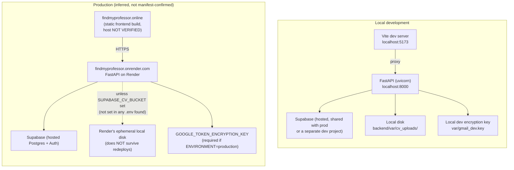

# Deployment Architecture

> Part of the [FindMyProfessor Architecture Documentation](../ARCHITECTURE.md).

## 1. No deployment manifest exists in this repository

An exhaustive search (excluding `node_modules`, `.git`, `venv`) found **zero** deployment configuration files: no `Dockerfile`, `docker-compose.yml`, `render.yaml`, `railway.json`/`.toml`, `vercel.json`, `netlify.toml`, `Procfile`, `fly.toml`, `app.json`, or `.github/workflows/*.yml`. **Hosting configuration is not version-controlled.** Everything below about the actual production environment is inferred from code comments, environment-variable checks, and non-secret URL values found in `.env` files — not from an authoritative manifest. Where noted, treat it as strong circumstantial evidence, not confirmed fact.

## 2. Evidence pointing to the hosting platform

| Evidence | Location | What it implies |
|---|---|---|
| Comment naming the platform directly | `backend/app/main.py:14-18`: *"a misconfigured/missing Render env var can't silently break the deployed SPA"* | Backend is deployed on **Render** |
| A functional check on Render's own auto-injected env var | `backend/app/routers/gmail.py:51`, checking `RENDER` (not in `.env.example` — Render sets this automatically on every deployed service) | Strong confirmation — this is a runtime behavioral dependency on Render, not just a comment |
| Production API URL | `frontend/.env.production:2`: `VITE_API_URL=https://findmyprofessor.onrender.com` | Confirms the backend's actual production domain is an `.onrender.com` subdomain |
| Production frontend domain | `frontend/.env.production:1` and `main.py:18`: `https://findmyprofessor.online` (also hardcoded as a CORS default) | Confirms the product's custom domain; **the frontend's actual hosting platform is not confirmed** — it could be static hosting on Render, Vercel, Netlify, or elsewhere; `frontend/.env` only lists these as generic illustrative examples, not a stated choice |

**NOT VERIFIED FROM CURRENT CODEBASE:** the exact frontend hosting provider, whether CI/CD exists at all, how a deploy is actually triggered, and the specific backend web worker/process configuration.

## 3. Local development vs. production

## 4. Environment variable inventory

| Variable | Purpose | Required in prod? | Notes |
|---|---|---|---|
| `SUPABASE_URL`, `SUPABASE_SERVICE_ROLE_KEY` | Backend DB/auth client | Yes — app fails to start without these (`supabase_client.py:16-17`) | Service-role key bypasses RLS entirely; see [Data Model §5](data-model.md#5-row-level-security--explicitly-not-used) |
| `SUPABASE_CV_BUCKET` | Durable CV storage backend | No (optional) | **Undocumented in `.env.example`, not set in any `.env` file found in this repo.** Without it, CV files default to local disk (`cv/storage.py:23`) — see §5 |
| `LLM_API_KEY`, `LLM_BASE_URL`, `LLM_MODEL` | CV extraction LLM provider | No — blank means the deterministic/heuristic path is used | See [CV Pipeline §7](cv-pipeline.md#7-structured-field-extraction--heuristic-vs-llm) |
| `EMAIL_LLM_API_KEY`, `EMAIL_LLM_BASE_URL`, `EMAIL_LLM_MODEL` | Email generation LLM provider, overrides the `LLM_*` vars if set | No — same deterministic-by-default pattern | See [Email Generation §5](email-generation.md#5-provider-selection-and-the-silent-fallback-behavior) |
| `GOOGLE_CLIENT_ID`, `GOOGLE_CLIENT_SECRET`, `GOOGLE_REDIRECT_URI` | Gmail OAuth | Yes, for the Gmail feature to function | `GOOGLE_REDIRECT_URI` must exactly match what's registered in Google Cloud Console |
| `GOOGLE_TOKEN_ENCRYPTION_KEY` | Fernet key for encrypting stored Gmail tokens | **Hard-required only when `ENVIRONMENT` is `production`/`prod`** | See [Gmail OAuth §7](gmail-oauth.md#7-token-encryption) for the flagged inconsistency with the `RENDER` check used elsewhere |
| `ENVIRONMENT` | Switches on stricter production checks | Should be `production` in prod | Default `development`; **not present as a key in the root `.env` or `backend/.env` files inspected** — meaning local dev relies entirely on the default |
| `RENDER` | Render's own auto-injected marker | N/A — set automatically by the platform | Checked directly in `backend/app/routers/gmail.py:51` as a second, independent "are we hosted" signal |
| `FRONTEND_URL`, `CORS_EXTRA_ORIGINS` | CORS allow-list additions | Effectively required in a hosted environment (raises `RuntimeError` if hosted and blank) | `main.py:34-42` |
| `VITE_API_URL`, `VITE_SITE_URL` (frontend) | Backend API base URL and canonical site URL | Yes for a correct prod build | Dev: `localhost:8000` / `localhost:5173`. Prod: `https://findmyprofessor.onrender.com` / `https://findmyprofessor.online` |

## 5. CV storage: local disk by default, flagged unsafe by the code itself

Already covered in depth in [CV Pipeline §5](cv-pipeline.md#5-storage-location--local-disk-by-default-and-the-code-says-so-is-risky), repeated here because it's a deployment-level risk, not just a CV-pipeline detail: `backend/app/cv/storage.py:11-22` states directly that Render's local disk does not persist across redeploys/restarts, so local-disk-only storage is unsafe in production — yet `SUPABASE_CV_BUCKET`, the escape hatch that switches to durable Supabase Storage, is absent from every `.env` file present in this repo. **As currently configured (based on what's checked into/available in this repository), a backend redeploy on Render would lose previously uploaded CV files while their database metadata (`cv_versions` rows) survives untouched.**

## 6. Legacy static HTML pages

`backend/app/static/` contains 11 HTML files — `login.html`, `matches.html`, `professor_match.html`, `outreach_history.html`, `cv_onboarding.html`, `email_draft.html`, `privacy.html`, `terms.html`, `index.html`, `gmail_connected.html`, `gmail_error.html` — evidently an earlier, server-rendered version of the product, predating the React SPA.

**These are confirmed dead as application pages.** `main.py:70` mounts `StaticFiles` at `/static` only (serving raw files, not routing pages), and `main.py:75-77` states directly: *"Legacy HTML pages... have been removed from FastAPI. The React frontend... renders them."* A repository-wide search for any `FileResponse`/`send_file`/`.html` reference inside `backend/app` returns zero hits — no router serves any of these files as an actual page route. They remain fetchable byte-for-byte at `/static/<name>.html` (since `StaticFiles` serves the whole directory verbatim), but nothing in the live application links to or navigates through them. Treat this directory as inert legacy content, not part of the active architecture.

## 7. Root `package.json`

Confirmed to be a thin convenience wrapper only — two scripts (`test:frontend`, `test:backend`), no dependencies of its own. It is **not** a monorepo build tool; the frontend and backend are built and (presumably) deployed independently.
