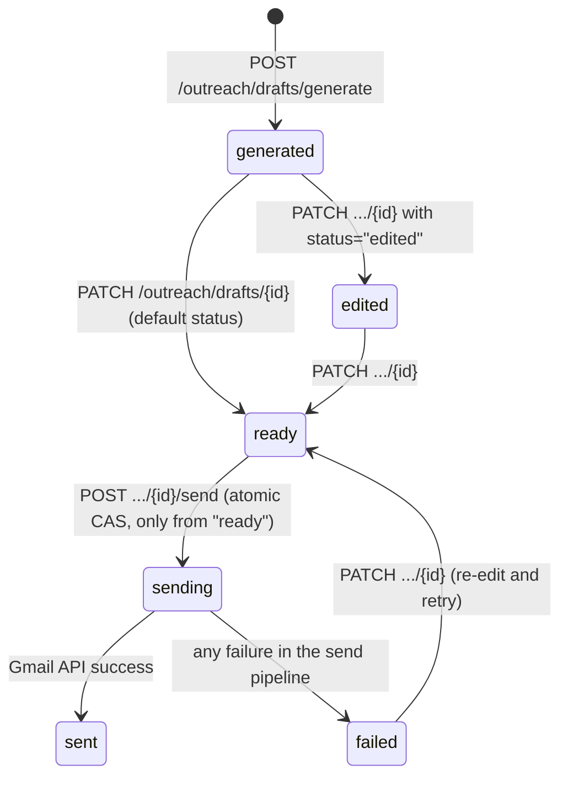
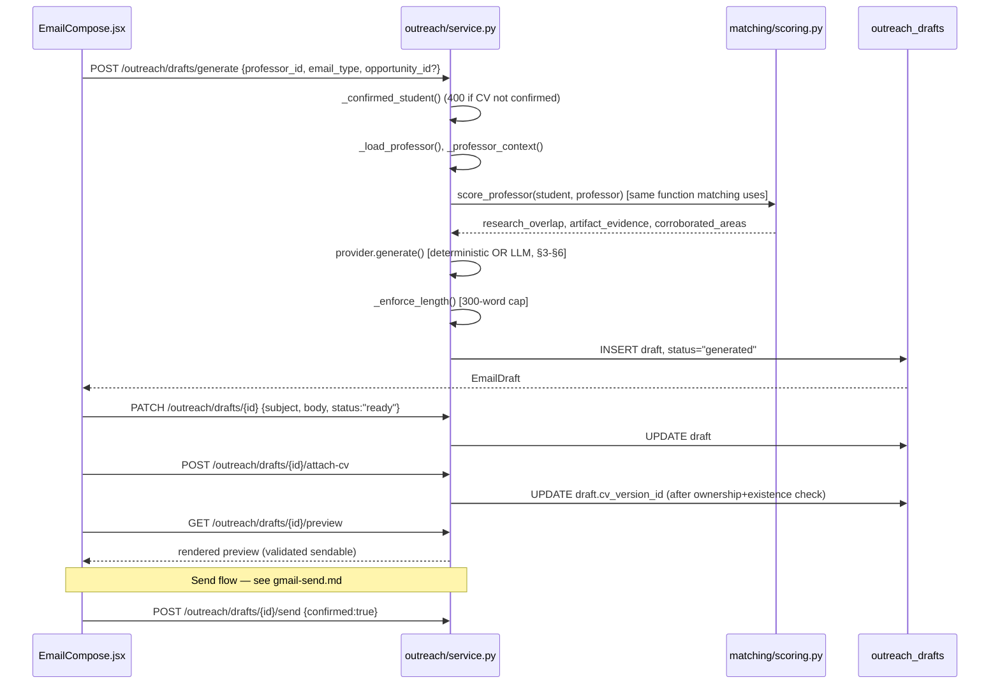

# Email Generation Architecture

> Part of the [FindMyProfessor Architecture Documentation](../ARCHITECTURE.md).

## 1. Draft lifecycle — state machine

```
DraftStatus = "generated" | "edited" | "ready" | "sending" | "sent" | "failed"
```
(`backend/app/outreach/models.py:8`, `backend/app/schemas/outreach.py:9`, mirrored in the DB comment at `backend/migrations/20260909_outreach_drafts_gmail.sql:23`.)



| Status | Set where | Trigger |
|---|---|---|
| `generated` | `generate_draft()`, `service.py:107` | `POST /outreach/drafts/generate` |
| `edited` | Only if the caller explicitly passes `status="edited"` | `PATCH /outreach/drafts/{id}` |
| `ready` | Default parameter of `save_draft()` (`service.py:123`) and of `SaveDraftRequest.status` (`schemas/outreach.py:47`) | `PATCH /outreach/drafts/{id}` (default case) |
| `sending` | `atomically_set_sending()`, a conditional `UPDATE ... WHERE status='ready'` (`db_store.py:189-196`) | Only from inside `send_draft()`, only if current status is exactly `ready` |
| `sent` | `service.py:332`, after a successful `send_message()` call to Gmail | Terminal |
| `failed` | `_mark_failed()` (`service.py:491-499`), called from every failure branch of `send_draft()` | Any pipeline failure after `sending` was acquired |

**Enforcement gap, stated plainly:** `save_draft()` has **no state-machine guard** — it will overwrite `status` to whatever the caller sends, including jumping a fresh draft straight to `"sent"` via a raw `PATCH`. The only truly atomic, guarded transition is `ready → sending`. There is also a minor inconsistency: `_validate_for_send()` accepts both `"ready"` and `"edited"` as sendable (`service.py:439-448`), but `atomically_set_sending()` only succeeds from exactly `"ready"` — so an `"edited"` draft can pass validation and then still fail the atomic transition with a 409 ("Cannot send: draft status is 'edited'. Save as 'ready' first."). **NOT VERIFIED FROM CURRENT CODEBASE** whether this is intentional friction or an oversight.

## 2. Prepare/generate — what evidence gets gathered

**`POST /outreach/drafts/generate`** (`backend/app/routers/outreach.py:28-44`) → `generate_draft()` (`service.py:71-114`). Body: `professor_id`, `email_type` (`"research"` | `"research_opportunity"`), optional `opportunity_id`. `profile_id` comes only from `auth.require_profile_id`.

Before any text is generated, the service assembles an **evidence bundle**, each piece independently verified against the database:

1. `_confirmed_student()` (`service.py:506-523`) — loads the CV-extracted profile. **Hard-fails with HTTP 400 if the CV isn't uploaded, confirmed, or if its last parse failed.** An unconfirmed CV blocks email generation entirely — this is the same "confirmed" gate matching depends on.
2. `_load_professor()` (`service.py:526-530`) — 404 if the professor doesn't exist.
3. `_professor_context()` (`service.py:533-552`) — builds a verified structure: name, title, email, university, department, lab, research areas, research summary — straight from the `professors` table join, not from anything user-supplied.
4. `_load_catalog()` (`service.py:555-559`) — the shared `research_areas` catalog.
5. `_build_match_context()` (`service.py:562-595`) — runs the **exact same deterministic `score_professor()`** used by the matching engine, producing `research_overlap`, `shared_interest_areas`, `artifact_evidence`, and `corroborated_areas`. Email generation and professor matching share one scoring function — this is how the email can honestly say "you both work in X" without a second, divergent notion of "match."
6. `_load_opportunity_context()` (`service.py:598-619`) — optional; returns 400 if the selected opportunity is `closed`.
7. `_enforce_length()` (`service.py:622-627`) — truncates the generated body to 300 words, applied uniformly to both providers below.

## 3. Provider abstraction

`backend/app/outreach/provider.py` defines an abstract `EmailGenerationProvider` with one method, `generate(...)`. Two concrete implementations:

### Deterministic provider (default, zero cost)

`backend/app/outreach/deterministic.py`, `DeterministicTemplateProvider` — pure string templating, **no network calls at all**.
- **Subject** (`deterministic.py:156-166`): picks the first overlap research area, rotates through 3 subject templates using a process-global counter.
- **Body** (`deterministic.py:172-240`): fixed structure — greeting ("Dear Professor {last_name},"), a rotating intro (3 templates), a research-opener paragraph plus a "best evidence" hook (prefers a publication over a project when both exist, and prefers evidence tied to an overlapping area), a fit/ask paragraph, an optional opportunity paragraph, and a closing.

Because every interpolated value traces directly to a verified field (`ProfessorContext`, `MatchContext`, or the CV-extracted profile), **fabrication is structurally impossible on this path** — there is nothing generative about it; it's `.format()` substitution.

### LLM provider (optional, requires an API key)

`backend/app/outreach/llm.py`. Only active if `EMAIL_LLM_API_KEY` or `LLM_API_KEY` is set (see §5). Call config: `temperature=0.4, max_tokens=600, timeout=30.0` (`llm.py:152-175`). Like the CV extractor, this is a hand-rolled `httpx` call to an OpenAI-compatible endpoint — no LLM SDK dependency in `requirements.txt`.

## 4. What data enters the LLM prompt — and what deliberately doesn't

**Enters the prompt** (`_build_user_prompt()`, `llm.py:48-97`):
- Student name, a constructed degree phrase (degree + field + institution)
- The student's *verified* research interests
- The *verified shared* research areas (i.e. the actual overlap computed by `score_professor()`, not the student's raw wishlist)
- Student project/publication **titles**, but only the ones already tied to a matched area — not the student's entire artifact list
- Professor name, university, department, lab, research areas
- The requested `email_type`
- If an opportunity is selected: its title, type, status, and university — with an explicit prompt instruction that it's offered *by the university, not necessarily personally by the professor* (`llm.py:73`)

**Deliberately excluded:**
- The raw CV text/file bytes — never sent, only the pre-extracted, matching-verified structured fields chosen above
- The professor's raw free-text `research_summary` — only their structured `research_areas` list is sent, not their prose bio (reduces the model's opportunity to lift/misattribute claims from unstructured text)
- `corroborated_areas` — used only for post-hoc display, not fed into the prompt
- Professor email address, professor UUID, opportunity UUID, any auth tokens, or `profile_id`

**System prompt guardrails** (`_SYSTEM_PROMPT`, `llm.py:30-45`) instruct the model explicitly: use only the facts provided; never claim to have read a paper that wasn't listed; never claim the professor is actively recruiting unless that's stated; never invent topics, papers, labs, funding, or deadlines; omit missing information rather than guess it. The abstract `EmailGenerationProvider` class docstring states the identical contract (`provider.py:59-68`).

## 5. Provider selection and the silent-fallback behavior

`backend/app/outreach/factory.py:9-29`: `EMAIL_LLM_API_KEY` takes priority over `LLM_API_KEY`; if neither is set, the deterministic provider is used — same default-safe pattern as CV extraction. `EMAIL_LLM_BASE_URL`/`LLM_BASE_URL` and `EMAIL_LLM_MODEL`/`LLM_MODEL` follow the same override precedence.

**Important finding:** if the LLM call raises *any* exception, `LlmEmailProvider.generate()` (`llm.py:117-142`) **silently falls back to the full deterministic output** — and critically, the resulting draft's `generation_provider` field is recorded as `"deterministic"`, which is **indistinguishable from the true default (no LLM configured at all) path**. There is no logging distinguishing "LLM was never tried" from "LLM was tried and failed." If you're debugging why an LLM-configured deployment is producing template emails, this is the first place to look — but the data itself won't tell you.

## 6. Anti-hallucination / anti-fabrication measures — the honest picture

There are exactly two mechanisms, both preventative (restricting inputs), and **zero** mechanisms that are corrective (checking outputs):

1. **Input restriction** — only verified, matching-scored fields are interpolated into the prompt at all (§4). The model is never given the full CV or the professor's full bio to freely draw from.
2. **Prompt instructions** — the system prompt explicitly tells the model not to fabricate (§4).

**There is no post-generation validation anywhere in the code.** `_parse_llm_response()` (`llm.py:178-194`) only splits the raw response into subject/body — it does not check that the professor's name, a research area, or an artifact title actually appears in the output. `_enforce_length()` (`service.py:622-627`) is the only backend guardrail applied to LLM output, and it's a word-count truncation, not a fact-check. **In short: anti-fabrication relies entirely on (a) narrowing what the model is given and (b) trusting the model to follow instructions — there is no code-level verification that the output matches the evidence.** This is an honest limitation to state directly rather than imply otherwise.

## 7. Draft storage

Table `outreach_drafts` (full DDL in `backend/migrations/20260909_outreach_drafts_gmail.sql:11-32`): `id`, `profile_id` (FK → `profiles`, `ON DELETE CASCADE`), `professor_id` (**plain UUID, no FK constraint**), `email_type`, `subject`, `body`, `selected_opportunity_id` (FK → `opportunities`, nullable), `cv_version_id` (FK → `cv_versions`, nullable), `matched_research_areas`/`evidence_used` (JSONB), `generation_provider`, `status` (**no DB `CHECK` constraint** — the enum is enforced only in application code, not the schema), `sent_at`, `gmail_message_id`, `gmail_thread_id`, `error_code`, `error_message`, timestamps.

Storage is via `backend/app/outreach/db_store.py`, which supports both a real Supabase-backed mode and an in-memory `_test_store` mode used by the test suite. Profile isolation is app-layer only (`service.py` checks `draft.profile_id == profile_id` before any read/write) — same pattern as everywhere else in this codebase; see [Data Model §5](data-model.md#5-row-level-security--explicitly-not-used).

One minor discrepancy worth flagging: `selected_opportunity_id` exists as both a model field and a DB column, but is **never actually set** inside `generate_draft()` despite an opportunity being loadable during generation (`service.py`) — NOT VERIFIED as a bug vs. deliberate (the opportunity context may be intended to be attached to the draft only via a separate step not covered by this pass).

## 8. Edit flow

**`PATCH /outreach/drafts/{draft_id}`** (`backend/app/routers/outreach.py:47-60`) → `save_draft()` (`service.py:117-140`). Body: `subject`, `body`, `status` (default `"ready"`). A student can freely rewrite both subject and body, and set status to any of the six enum values in one call — there's no separate "confirm my edits" step distinct from the save itself.

## 9. CV attachment reference

`DraftRecord.cv_version_id` is set via **`POST /outreach/drafts/{id}/attach-cv`** → `attach_cv()` (`service.py:193-219`), which validates draft ownership, CV ownership, *and* that the underlying file still exists in storage (`cv_file_exists()`) before accepting the attachment. This is the field `_validate_for_send()` requires to be non-null before a send is allowed (`service.py:462-466`) — see [Gmail Send §CV attachment](gmail-send.md#cv-attachment) for how the file is actually retrieved at send time (never from a client-supplied path).

## 10. Explicit confirmation requirement before send

Two independent, server-side gates (not just UI affordances):

1. **Status gate**: draft status must be `"ready"` or `"edited"` (`_validate_for_send()`, `service.py:439-448`) — reached only through the edit/`PATCH` flow described above.
2. **Explicit confirmation flag**: `SendDraftRequest.confirmed: bool` is a **required Pydantic field with no default** (`schemas/outreach.py:79-81`) — omitting it is a validation error, not an implicit "no." `send_draft()` additionally re-checks it explicitly and returns 400 if falsy (`service.py:263-267`), so the guarantee doesn't rely on Pydantic alone.

Combined with the atomic `ready → sending` compare-and-swap DB transition (see [Gmail Send](gmail-send.md)), this makes sending a single, explicit, non-repeatable, user-confirmed action — never something that could fire automatically or twice.

## 11. Failure handling

| Failure point | Behavior |
|---|---|
| CV not uploaded/confirmed/parse-failed | 400 at generation time, no draft created |
| Professor not found | 404 |
| Selected opportunity is closed | 400 |
| LLM call fails during generation | Silently falls back to deterministic output (§6) — **not** a user-visible failure |
| DB write fails on `store.put()` | No explicit `try/except` around it in `generate_draft()` — would surface as an unhandled 500 (NOT VERIFIED whether a global handler catches this) |
| Any send-pipeline failure (CV missing, token unavailable, MIME build error, Gmail API error) | Routed through `_mark_failed()` (`service.py:491-499`), which itself best-effort persists `status="failed"` + `error_code`/`error_message`, swallowing its own persistence errors with only a log line |

## 12. Lifecycle sequence diagram


