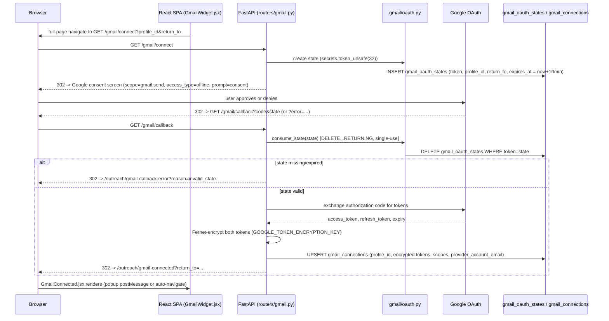

# Gmail OAuth

> Part of the [FindMyProfessor Architecture Documentation](../ARCHITECTURE.md).

This is a completely separate authorization system from application login — see [Auth vs Authorization](auth-and-authorization.md) for how the two relate. This document covers only how a student grants FindMyProfessor permission to send email through their own Gmail account.

## 1. Connect endpoint

**`GET /gmail/connect`** — `backend/app/routers/gmail.py:93-130`. Accepts `profile_id` via `X-Profile-Id` header or query parameter. It cannot rely on a verified Supabase session here, and the code says so explicitly (`gmail.py:107-117`): this endpoint is reached by a **full-page browser navigation** (the user is redirected away to Google), which cannot carry a custom `Authorization` header the way an `fetch()` call can.

`return_to` (where to send the user back to in the SPA afterward) is sanitized against open-redirect abuse before use (`gmail.py:74-86`).

## 2. OAuth state generation and storage

State token: `secrets.token_urlsafe(32)` (`backend/app/gmail/oauth.py:99`) — cryptographically random, not a predictable value. Stored as a row in the `gmail_oauth_states` table: `token` (primary key), `profile_id`, `return_to`, `expires_at` (`backend/migrations/20260910_gmail_oauth_states.sql:10-16`).

**This table replaced an in-memory Python dict**, and the migration file explains exactly why — worth quoting directly because it's a real production lesson baked into the codebase:

> "An in-memory store does not survive a Render restart/redeploy, and breaks entirely if the backend ever runs more than one worker/instance — a request handled by one process cannot see state created by another. This table makes state survive both." (`20260910_gmail_oauth_states.sql:6-9`)

## 3. State expiration

`_STATE_TTL_SECONDS = 600` — exactly 10 minutes (`gmail/oauth.py:50`).

## 4. Single-use enforcement

`consume_state()` (`oauth.py:121-168`) **deletes the row as part of reading it** — there's no separate "used" boolean to check and forget to enforce. Only the one request whose delete actually removes a row is allowed to proceed; a concurrent or replayed request finds nothing to delete and is rejected (explicit race-safety comment in the code, `oauth.py:149-154`). Expiry is checked *after* the delete succeeds.

## 5. Authorization URL — scope confirmation

`authorization_url()` (`oauth.py:187-199`). The requested scope is **exactly one string**:

```
GMAIL_SEND_SCOPE = "https://www.googleapis.com/auth/gmail.send"   # oauth.py:64
```

No read scope, no `gmail.modify`, no `gmail.compose`, no `openid`/`profile`/`email` scopes. `redirect_uri` comes from the required `GOOGLE_REDIRECT_URI` environment variable; `client_id` from `GOOGLE_CLIENT_ID`. `access_type=offline` and `prompt=consent` are both set, forcing Google to issue a `refresh_token` on every consent (not just the first time), which is required for the backend to keep sending on the student's behalf without them re-consenting every hour.

## 6. Callback endpoint

**`GET /gmail/callback`** — `backend/app/routers/gmail.py:137-224`. Every distinct failure mode maps to a specific `reason` query param on the frontend error redirect:

| Condition | `reason` |
|---|---|
| Google reports `error=` (user denied consent) | `denied` |
| Missing `code` or `state` | `missing_params` |
| State not found / already consumed / expired | `invalid_state` |
| Token exchange with Google fails | `exchange_failed` |
| Google returns no `access_token` | `no_token` |
| Writing the connection to the DB fails | `store_failed` |

On success, the backend stores the connection (§8) and redirects (302) to the frontend, optionally honoring the sanitized `return_to`.

## 7. Token encryption

`backend/app/gmail/crypto.py`. Algorithm: **Fernet** (from the `cryptography` package), keyed by the `GOOGLE_TOKEN_ENCRYPTION_KEY` environment variable (`crypto.py:9, 26`).

**Production behavior:** if `GOOGLE_TOKEN_ENCRYPTION_KEY` is unset **and** `ENVIRONMENT` is `"production"`/`"prod"`, the app hard-fails with a `RuntimeError` at the point of use (`crypto.py:46-54`) — it refuses to encrypt tokens with a fallback key in a declared-production environment.

**Development behavior:** if unset in any other environment, the app generates an ephemeral key and persists it to a local file for the life of that dev instance, with a loud warning (`crypto.py:56-112`). This local key file is `var/gmail_dev.key` at the repo root, which is `.gitignore`d — confirmed as a local-only, never-committed dev artifact.

**A real inconsistency worth flagging directly:** this production-readiness guard checks **only** the `ENVIRONMENT` variable. Elsewhere in the same codebase, `backend/app/routers/gmail.py:49-51` uses a **second, independent** signal — the `RENDER` environment variable that Render auto-injects into every deployed service — to detect "we are definitely running in a hosted environment" for a *different* production-hardening check (the `FRONTEND_URL` requirement), and the code comment there explains this was added specifically after a live incident where `ENVIRONMENT` was left unset on a real Render deployment. The token-encryption guard in `crypto.py` was **not** updated to use the same `RENDER` check. Practically: if a Render deployment forgets to set `ENVIRONMENT=production` (exactly the scenario that already happened once, per that other comment), Gmail tokens would be silently encrypted with an ephemeral, non-persistent key instead of hard-failing — an inconsistency between two production guards in the same file area. **NOT VERIFIED FROM CURRENT CODEBASE** whether this is accepted risk or simply not yet backported; it's a legitimate, code-grounded thing to point out as a "next thing I'd fix."

## 8. Token storage

Table `gmail_connections` (`backend/migrations/20260909_outreach_drafts_gmail.sql:45-62`): `id`, `profile_id` (FK → `profiles`, cascade delete), `provider` (always `"google"` today, column exists for future extension), `provider_account_email` (plaintext — safe, never a token), `access_token_encrypted`, `refresh_token_encrypted`, `token_expires_at`, `scopes`, `revoked_at`, `UNIQUE(profile_id, provider)` (one active connection per student). Written via `upsert_connection()` (`backend/app/gmail/service.py:64-98`) — a fetch-then-update-or-insert pattern rather than a native atomic upsert; whether a genuinely concurrent first-time connect race is safe against the unique constraint is **NOT VERIFIED FROM CURRENT CODEBASE**.

No RLS policy exists for this table either — same app-layer-only isolation pattern as everywhere else; see [Data Model §5](data-model.md#5-row-level-security--explicitly-not-used).

## 9. Token refresh

`get_valid_access_token()` (`backend/app/gmail/service.py:133-201`) is called lazily, right before every send — there's no background refresh job. It refreshes if the stored token is within 60 seconds of expiry. If Google itself rejects the refresh attempt (400/401 — meaning the refresh token has been revoked or is otherwise invalid), the connection is marked unusable: `_mark_connection_unusable()` sets `revoked_at` (`service.py:234-252`), and a 401 with a "please reconnect" message is raised to the caller. Transient network errors or Google 5xx responses do **not** revoke the connection — only an explicit rejection from Google does. Errors are logged with only the HTTP status and Google's own `error`/`error_description` fields — the actual token values are never logged (`service.py:209-231`).

## 10. Frontend callback handling

The backend redirects the browser directly to React SPA routes — `/outreach/gmail-connected` and `/outreach/gmail-callback-error` (registered in `frontend/src/App.jsx:29-30`), **not** to any server-rendered page. `GmailConnected.jsx` supports two integration patterns: a popup flow (posts a message to the opener window and closes itself) or a direct navigate-back-to `return_to`/a pending intent stashed in `localStorage`. `GmailError.jsx` maps the `?reason=` query param (§6 table) to user-facing copy.

**The static files `backend/app/static/gmail_connected.html` and `gmail_error.html` still exist on disk but are dead.** They're mounted under `/static` (`backend/app/main.py:70`) as raw static assets, but nothing in the live OAuth redirect logic references them — every redirect in `routers/gmail.py` targets the React SPA routes above. See [Deployment §Legacy static pages](deployment.md#legacy-static-html-pages) for the fuller picture of why these files still exist.

## 11. Full sequence diagram


