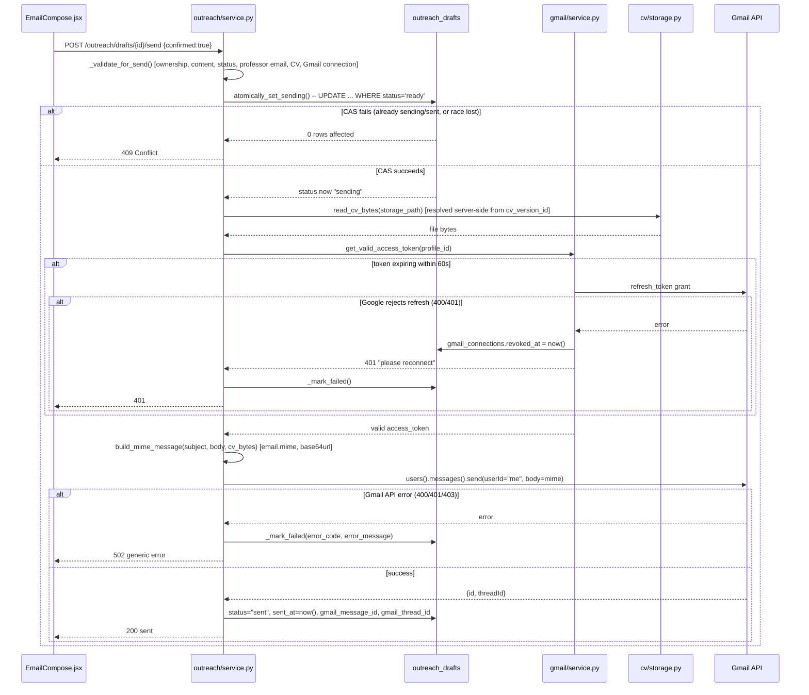

# Gmail Send Flow & CV Attachment

> Part of the [FindMyProfessor Architecture Documentation](../ARCHITECTURE.md). See [Gmail OAuth](gmail-oauth.md) for how the token being used here was obtained, and [Email Generation](email-generation.md) for how the draft being sent was created.

## 1. Send endpoint and validation

**`POST /outreach/drafts/{draft_id}/send`** — `backend/app/routers/outreach.py:129-148` → `send_draft()` (`backend/app/outreach/service.py:246-346`). Body: `SendDraftRequest{confirmed: bool}` — `confirmed` has **no default**, so omitting it is a validation error, not an implicit "no" (`backend/app/schemas/outreach.py:79-81`).

Before anything is sent, `_validate_for_send()` (`service.py:415-488`) checks, in order:
1. Draft ownership (`draft.profile_id == profile_id`)
2. Subject and body are both non-empty
3. Status is `"ready"` or `"edited"` (see the status-vs-CAS inconsistency noted in [Email Generation §1](email-generation.md#1-draft-lifecycle--state-machine))
4. Professor exists and has a regex-validated email address
5. `cv_version_id` is set, and that CV version still belongs to this profile and still exists in storage
6. A live Gmail connection exists for this profile

## 2. Explicit confirmation requirement, enforced twice

- `confirmed` is a required schema field (not just a UI checkbox) — `schemas/outreach.py:79-81`.
- `send_draft()` **re-checks it explicitly in code** and returns HTTP 400 if it's falsy (`service.py:263-267`) — so the guarantee doesn't rely on Pydantic validation alone; even a client that bypasses schema validation still hits the same code-level check.

## 3. Atomic status transition — preventing double-send

`atomically_set_sending()` (`backend/app/outreach/db_store.py:180-201`) issues a single conditional update:

```sql
UPDATE outreach_drafts
   SET status = 'sending'
 WHERE id = ? AND profile_id = ? AND status = 'ready'
```

This is a classic compare-and-swap. If two send requests race for the same draft (e.g. a double-click, or a retried request), only one can successfully flip `ready → sending`; the loser's `UPDATE` affects zero rows and the request is rejected with `409 Conflict`. This is what makes "explicit confirmation" also mean "exactly-once," not just "asked nicely once."

## 4. CV attachment

`read_cv_bytes(storage_path)` (`backend/app/cv/storage.py:79-89`) retrieves the file server-side — either from a private Supabase Storage bucket via the backend's own service-role client, or from local disk with path-traversal guards (`storage.py:69-77`). **The storage path itself never appears in any API response schema** — the frontend only ever holds a `cv_version_id`, and the backend resolves that id to a file path internally at send time. This is the mechanism that keeps CV files private without needing a public URL: nothing outside the backend process ever sees or needs to see the actual storage path.

## 5. MIME construction

`backend/app/gmail/client.py:37-82` — built with the Python standard library's `email.mime` (`MIMEMultipart`, `MIMEText`, `MIMEApplication`), not a third-party mail library. The message body is plaintext only (no HTML variant). The `From` header is omitted when unknown; Gmail fills it in itself since the API call authenticates as `userId='me'`. The finished MIME message is base64url-encoded into `{"raw": ...}`, the exact format the Gmail API's `messages.send` expects.

## 6. Gmail API call

`googleapiclient.discovery.build("gmail", "v1", ...)`, then:

```python
service.users().messages().send(userId="me", body=mime_message).execute()
```

Confirmed as the literal call — `client.py:99-107`. The response's `id` and `threadId` fields are captured and stored as `gmail_message_id`/`gmail_thread_id` on the draft. Neither value is ever written to logs.

## 7. Error handling

| Source | Handling |
|---|---|
| No valid Gmail token available (never connected, or connection revoked) | 401, "please reconnect" |
| Token refresh rejected by Google (400/401) | Connection marked `revoked_at` (see [Gmail OAuth §9](gmail-oauth.md#9-token-refresh)); 401 to caller |
| Gmail API returns 400/401/403 on the send call itself | Wrapped as `GmailApiError`, surfaced as a generic, safe 502 to the client (no raw Google error text leaked), draft marked `status="failed"` with the extracted error code |
| MIME construction fails | Draft marked `failed` |
| CV file missing from storage at send time | Draft marked `failed` |

Every failure path funnels through `_mark_failed()` (`service.py:491-499`), which leaves the draft in a terminal `failed` state — **a draft can never get stuck in `sending`** after an error; it either reaches `sent` or `failed`, never hangs in between.

## 8. Why the system does not auto-send or auto-follow-up

A repository-wide search for any cron, scheduler, Celery, APScheduler, or background-task pattern across `backend/app` returns nothing. **Confirmed: there is no automation of any kind.** Every send is a single, synchronous HTTP request, gated by the explicit `confirmed: true` flag described in §2, initiated only by direct user action in the browser. There is no code path that could send an email without a human clicking "Send" at that exact moment, and no code path that revisits a sent draft later to send a follow-up. This is a deliberate safety property worth stating explicitly in an interview: the absence of automation isn't an oversight, it's the simplest possible way to guarantee a student is never surprised by an email going out on their behalf.

## 9. Full sequence diagram


